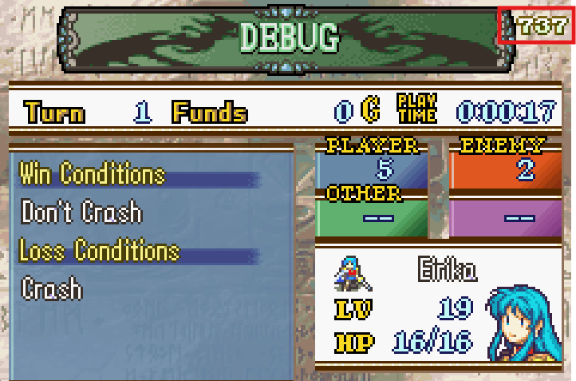
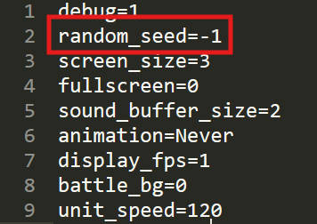
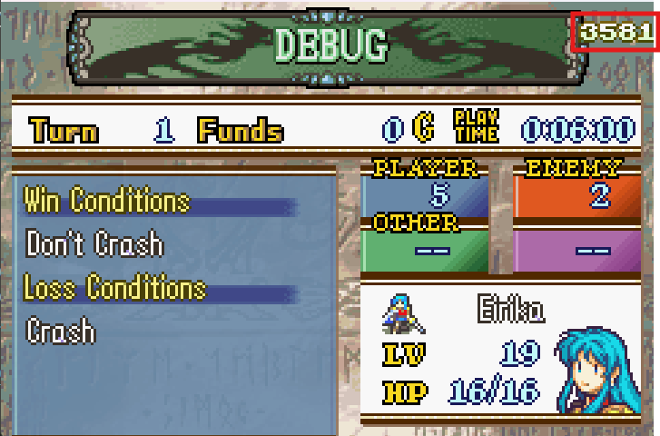

# Random Seed Mechanics

You may notice a number on the top right of the Objective menu:

This is the random seed. When you start a new game, you will be assigned a random seed for the game. This seed will stick with you throughout the game. It controls what happens whenever a random outcome is required.

If you turnwheel back in time and then do the exact same actions in the exact same order, the exact same outcome will occur. Only changing the seed will cause a different outcome from the same actions.

Because the random seed does not change, your units will always level up identically in your game, even if you turnwheel back to before they leveled up. This prevents RNG abuse to guarantee good level ups.

### Assigning a specific seed

You can assign a specific random seed before you start a new game by modifying your `config.ini` file here:

By default, it is -1, which causes a random seed between 0 and 1024 to be chosen at random on start of a new game. You can set it to any integer if you want though. It won't necessarily display all the characters of that integer though, since there isn't enough room.

