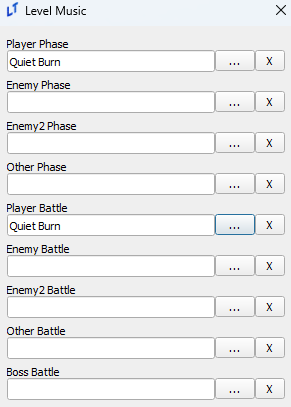
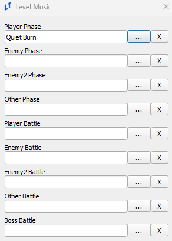
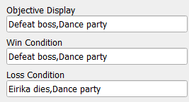
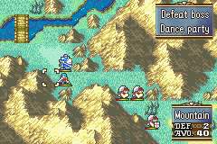
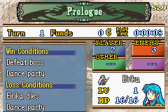
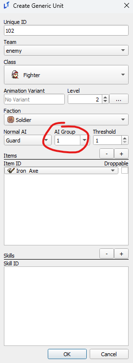
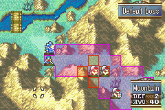

# Level Editor

_last updated 2024-11-11_

## Level Music

A lesser known behavior of the LT music system is that "battle" variations of music will only play if the music is set to the battle slot as well as the phase slot. If you set music to only the phase slot but not the battle slot, the non-battle variant will continue playing.

 

The setup on the left will play the battle variation in combat, while the one on the left will not. You can take advantage of this behavior and set/unset battle music via an event midway through a chapter for additional musical effect.

## Display Formatting

Unlike the text in many other editors/eventing, the objective displays use commas to break lines, like so.

  

## Formations and Deployment

Formation regions set your default deployment count for a chapter. For those that want a greater control over deploy count, the `_prep_slots` and `_minimum_deployment` level variables can be used to set upper and lower bounds for deployment count. More information can be found in the [Level Variables](../appendix/Special-Variables.md#level-variables) appendix entry.

## AI Groups

AI Groups can be set in the units editor for both generics and normal units, allowing units in the same group to all charge at once if a number of units equal to the threshold could attack your army.

However, as seen below, enemies with the 'Guard' type AI will still have a stationary range display. This is a lie; they will charge.

