# Overworld Editor

Given that you're on a FE Hack-like engine's repository, I dare to assume that you know what the overworld is. This page will briefly describe how to create an overworld in the editor and manage it in-game via events.

## Overworld Editor Location and Usage

The Overworld Editor can be accessed via the overworld tab, in much the same fashion as the Level Editor. 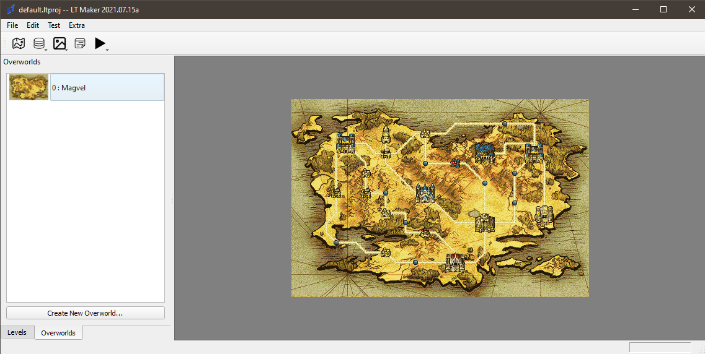

This is the overworld which ships with the `default.ltproj` project. You can use this as a base for your overworld, or create a new one. I'll make a new one for the benefit of the reader, but it'll be uninspired. You'll see.

**Click the Create New Overworld button to do the thing, and double click to enter the editor.**

On the left side, there are a lot of fields that are effectively self-explanatory.

* **Overworld ID** is the internal ID of the overworld. Make it memorable, make it count.
* **World Name** is the name of the overworld that will be displayed in the game to the player.
* **Overworld Theme** allows you to select the theme that plays on the overworld first. Don't be too attached; this can be changed via events, of course.
* **Select Tilemap** allows you to select one of the existing tilemaps to be used as the overworld background. Given that you can import any image as a tilemap, this should allow you to use an arbitrary image of your choice - maybe even one you made yourself - as your world map.
* **Border Width** is a number that indicates how thick the border of the map is. This border determines how close a cursor can get to the edge of the map. It's fine leaving this at 0, but for those with fancy borders on their maps, it may be more immersive to make use of a more restrictive cursor area.

Let's make an uninspired overworld:

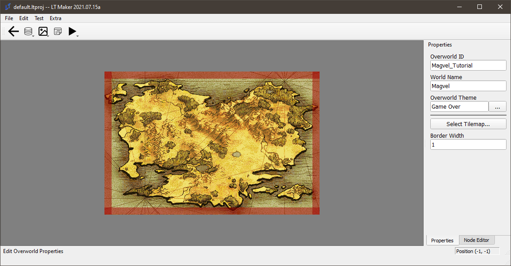

You can see that I've set the border to 1. The player cannot interact with the red zone, so be sure that you don't place anything important in it.

Now, onto **nodes** and **roads**!

The instructions are at the bottom of the screen, but to reiterate, all controls involve the mouse or the delete key. **Left-Click** selects an object; **Right-Click** moves it, while **Ctrl+Right-Click** creates roads. If a road does not start and end in a node it will not appear in game. **Double-L-Click** creates nodes.

We can make two nodes and a road between:

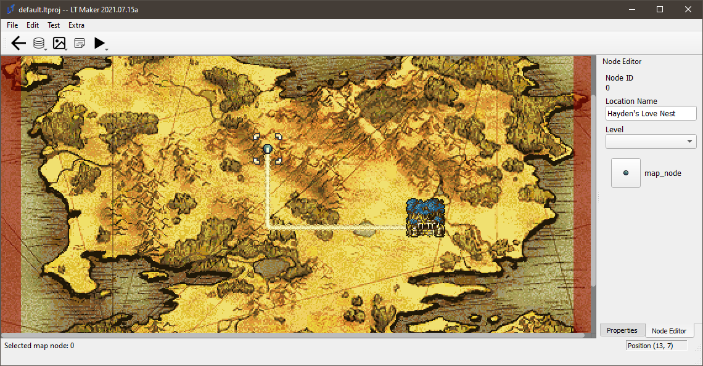The fields are as follows:

* **Node ID:** The ID of the node. You can't choose this one, but that's OK, because you can name the
* **Location Name**: You can name it whatever you like.
* **Level:** The level associated with this node. This is fairly important, as it indicates, in concert with the selected level, what set of events to use upon entering the node. Make sure to label your nodes with their proper levels!
* Finally, the clickable button at the bottom is the **Icon Selector**, where you can choose which icon to use to represent the node. You can see in the image above the use of the Forest Temple icon.

## Eventing the Overworld

This is one of those sections where a picture is worth a thousand words, and a gif with 60 frames by definition would be worth sixty thousand words. Incidentally, I'll be using the default overworld instead of the pile of garbage I created above, so please open `default.ltproj` for reference.

You can find this event in `default.ltproj`, level 1, `Outro`.

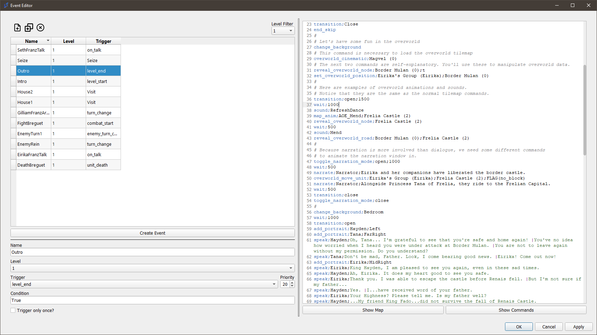

```
speak;Eirika;Thank you, Tana.
transition;Close
end_skip
#
# Let's have some fun in the overworld. Remove the background:
change_background
# This command is necessary to load the overworld tilemap
overworld_cinematic;Magvel (0)
# The next two commands are self-explanatory. You'll use these to manipulate overworld data.
reveal_overworld_node;Border Mulan (0);t
set_overworld_position;Eirika's Group (Eirika);Border Mulan (0)
#
# Here are examples of overworld animations and sounds.
# Notice that they are the same as the normal tilemap commands.
transition;open;1500
wait;1000
sound;RefreshDance
map_anim;AOE_Mend;Frelia Castle (2)
reveal_overworld_node;Frelia Castle (2)
wait;500
sound;Mend
reveal_overworld_road;Border Mulan (0);Frelia Castle (2)
#
# Because narration is more involved than dialogue, we need some different commands
# to animate the narration window in.
toggle_narration_mode;open;1000
wait;500
narrate;Narrator;Eirika and her companions have liberated the border castle.
overworld_move_unit;Eirika's Group (Eirika);Frelia Castle (2);no_block
narrate;Narrator;Alongside Princess Tana of Frelia, they ride to the Frelian Capital.
wait;500
transition;close
toggle_narration_mode;close
#
```

And you can see the results below:

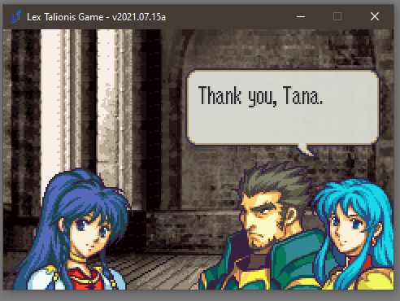

Not so painful, is it? There a variety of commands that are used in the overworld. All of them are documented in the `Show Commands` button in the event editor; feel free to check them out.

## Overworld Nodes

This guide will serve as an introduction to the “Overworld Node Menu Options” feature. If you have not done so, please read the guide on Overworlds in order to familiarize yourself with how they work, before reading this guide.

Overworld Node Menu Events are basically menu options that will appear when a player selects an Overworld Node that they are standing on. When selected, these options will call an event. There are various features available to control how much access the player has to these options.

To demonstrate how this feature works, we will create an Overworld Armory on Renais Castle.

Before we start with the new features, let's set up the event we need.
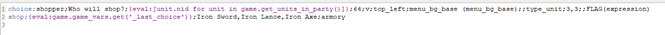

Keeping it short and simple for tutorial purposes. This event prompts the player to select a unit from their party, and then initiates a shop with that unit. The trigger, condition, and priority for this event do not matter, Node Menu options ignore these.

**IMPORTANT**: The event **MUST** be Global (not tied to any level or Debug), or else it cannot be called by the Overworld Node Menu Option.

Now that that's set up, let's walk through how to create a Node Menu Option. Navigate to the Overworld Editor, and select any node (I will be using Renais Castle, which is node NID 25 in the Sacred Stones project). To create a menu option for the node, click on the “Create Event” button.

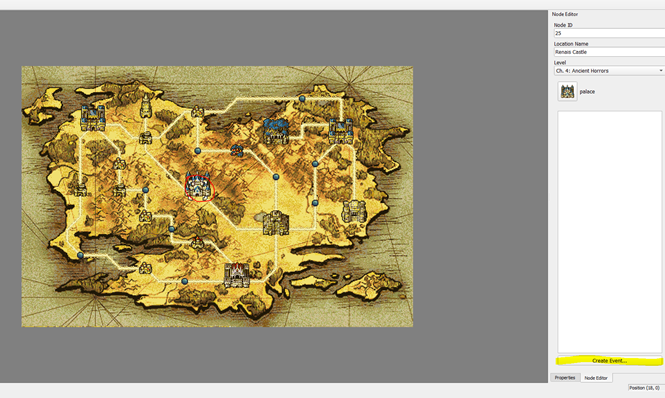
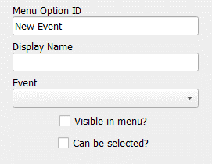

The new option will be automatically selected, and you will be presented with the following attributes.

Menu Option ID: This is the unique identifier of the option. Note that  this identifier is only unique for the Node itself (i.e., Two different nodes can have an option with the ID of “Armory”, but a single node cannot have 2 options of ID “Armory”).

Display Name: This is the name that is shown to the player in the menu. Mostly just aesthetic.

Event: The event this option will call. Only Global events will be available from this drop down.

Visible in Menu?: Whether this option is visible in the menu by default. Can be changed during gameplay via events. If an option isn't visible, it cannot be selected even if it is enabled. If visible but not enabled, the option will be grayed out.

Can be selected?: Whether this option is enabled by default. Can be changed during gameplay via events. If an option isn't visible, it cannot be selected even if it is enabled. If visible but not enabled, the option will be grayed out.

From here, we can set up our menu option.

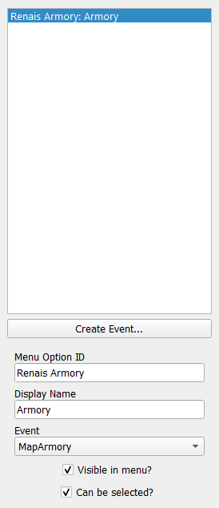

Our Node Menu Option is now ready! Time to test it in-engine. For this example, I have set things up such that the Overworld is triggered after the prologue, with both Border Mulan and Castle Renais being available. I have also given the party some money.

We simply need to navigate the party onto Castle Renais, and... voila! Our event is available.

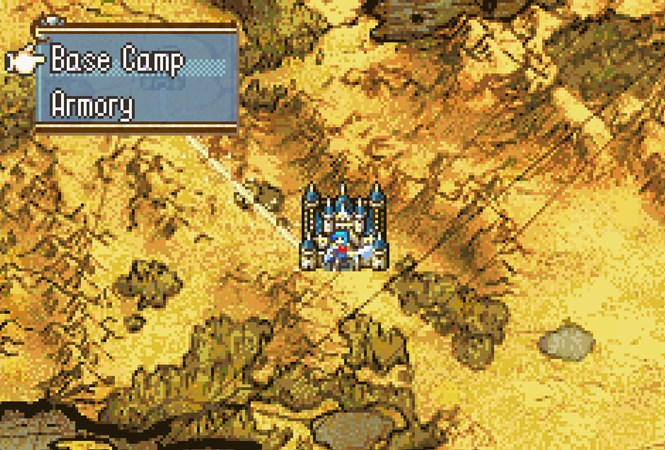

Let's select our event and see what happens.
We're given a (kinda ugly, I didn't care about the aesthetics) menu prompting us to select the unit to shop with.

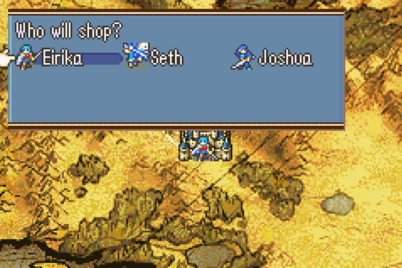

Select any of them, and...!

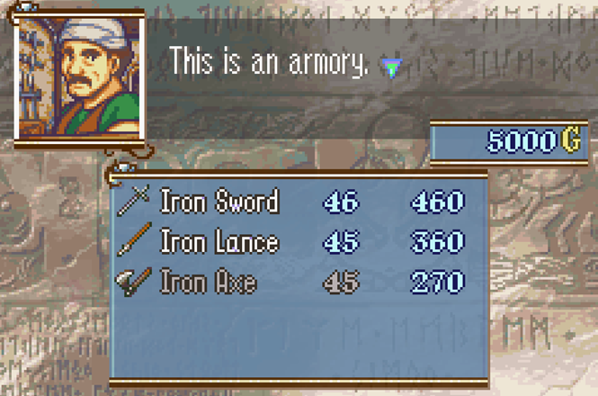

The shop works!

And that's all it takes to make a simple Node Menu Option. In the next tutorial, we will explore this feature in more depth, and go over the events you can use to alter the player's access to Node Menu Options.


