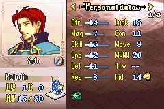

# Stats Editor

_last updated 2024-11-11_

## Stat Bars

In LT games, stat bars only display for stats on the left side of the info menu, as shown below.

If you wish, for example, to have the stat bar for Luck display, the stat must be moved to the left side of the display using the Position dropdown in the editor. Alternatively, with sufficient engine knowledge and python experience, you can change this behavior yourself by editing the engine directly.