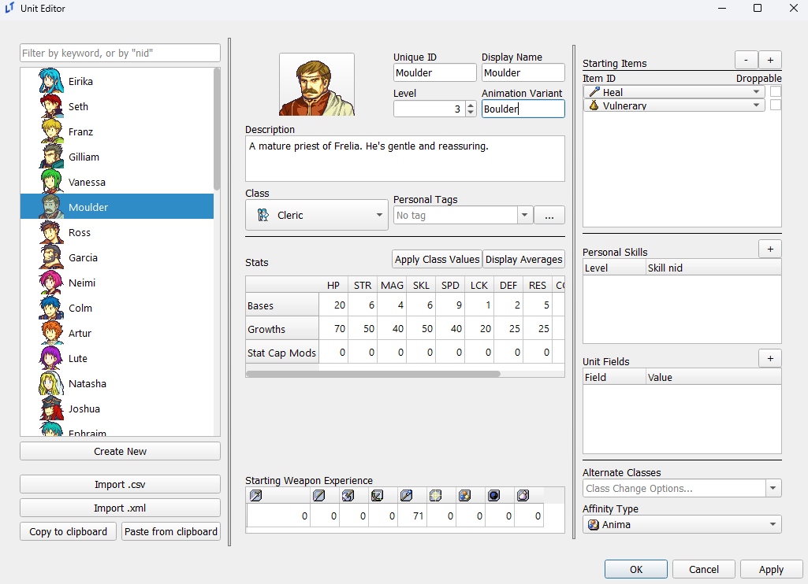
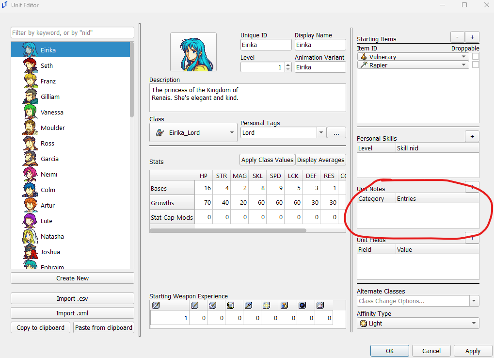
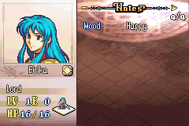

# Units Editor

_last updated 2024-11-11_

## Animation Variants

The Animation Variant field in the unit editor allows a specific unit to use an alternate animation for their class, removing the need to create an additional copy of a class for a specific unit solely for the purposes of a bespoke animation.

The animation used will be whichever animation bears **the name of the animation used by the unit's class, followed immediately by the text in this field**. For example, in the below example, we'll assign Moulder the `Boulder` variant.

If the name of the animation used by Moulder's current class is `Priest`, this will cause Moulder to instead use the animation named `PriestBoulder`. This applies to class changes as well; upon promoting to Bishop, if the Bishop uses an animation named `Bishop`, Moulder would then use the `BishopBoulder` animation.

## Unit Notes

By default, you may find the below section of your unit editor missing:

Unit notes are only displayed in the editor upon checking off the `Unit Notes` checkbox in the constants editor. Unit notes are displayed on the fourth page of your info menu, again only visible when this constant is enabled and unit notes are present. This is what is used for "Likes and Dislikes" in many hacks, although any text can be entered here.

You can also perform evals in unit notes, like so:

 

## Unit Fields

You can attach data to a specific unit in the form of strings via unit fields. The average FEGBA-adjacent project will not require these, but they can be used to assist with a variety of special game features, such as Genealogy-style personal funds.

There are various event commands to update and remove unit fields, and unit fields can be accessed via python expression with `UNIT.get_field(KEY)`, where UNIT is the unit object itself, and KEY is a string that matches the field name (whatever is in 'Field' in the editor).