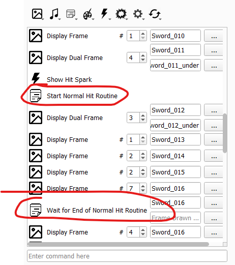
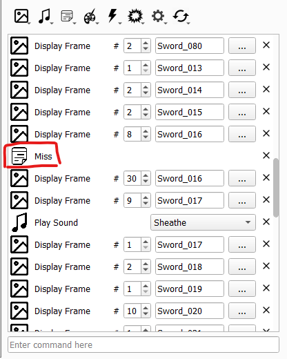
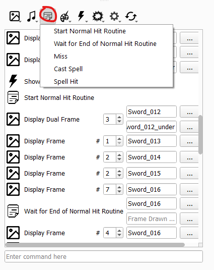

# Combat Animations Editor

_last updated 2024-11-13_

## Common Issues

### Attack/Miss Import Issue

Occasionally, a battle animation will cause your game to crash right before hitting. Check to make sure that the animation's `Attack` and `Critical` poses both start and stop the hit routine, as below.

Alternatively, the `Miss` pose will either be missing the miss routine, or erroneously have the start and/or stop hit routine. Ensure it *only* has the miss routine, as seen below.

If hit/miss instructions are incorrect or missing, add them in at the appropriate locations through the below dropdown.

### Missing Spell

If a battle animation is not playing (it defaults to map animation despite a battle animation being set for the unit/class), it is generally an issue fetching the spell effect for that animation.

If the battle animation is *not supposed* to use a battle cast animation (such as for a melee weapon), ensure that the animation does *not* have the `Cast Spell` instruction.

If the battle animation *is* supposed to use a specific battle cast animation, as in the case of magic tomes, check to make sure that the item the unit is using has a valid `Battle Cast Anim` component.

If the battle animation is supposed to use a generic battle cast animation, such as all bows using arrows, ensure that the effect referenced in the `Cast Spell` instruction of the animation is present in the Combat Effect tab and is not set to `None`.