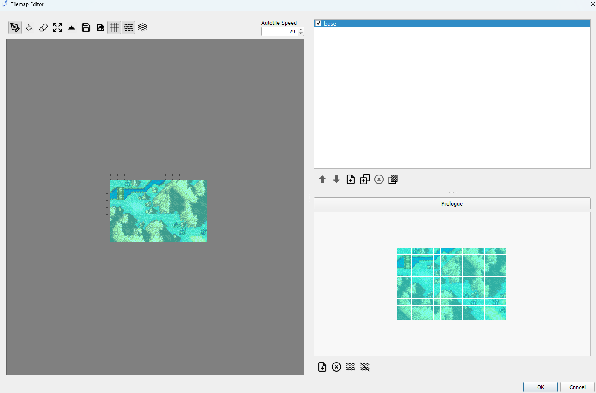
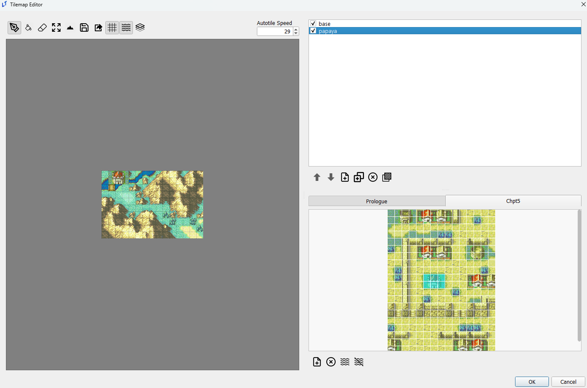
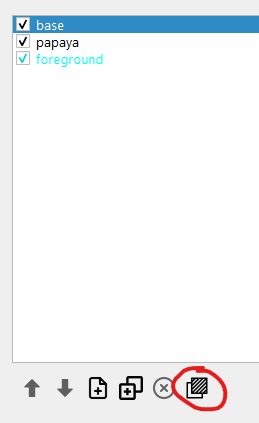
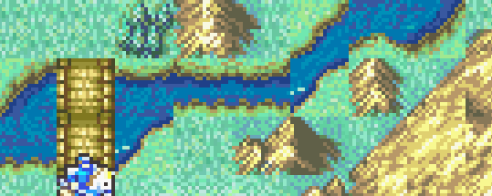
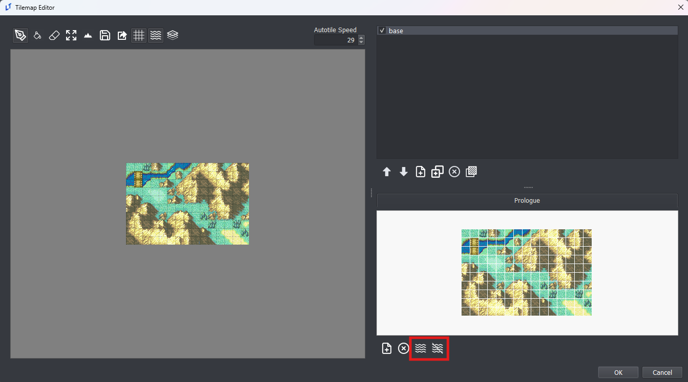
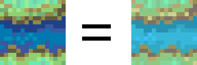

# Tilemaps Editor

_last updated 2024-11-13_

## Importing

**Tilesets** can be imported from any .png image that is some multiple of 16x16 in size. It is not possible to import **tilemaps** in this way, but it is possible to import a .png of a tilemap as a tileset and then use that tileset to create a map by selecting the entire tileset and applying it to the map.

## Layers

Layers in the LT tilemap editor function as both image editing layers and FEGBA tile changes.

Layers are displayed in *inverse* order of priority; the base layer is at the top, while the top-most layer is at the bottom, as below.

 

Note that checking/unchecking layers in the tilemap editor does not do anything in-game, and is solely meant for visual aid while editing tilemaps. Only the base layer is visible by default in-game; use the `show_layer` and `hide_layer` event commands to toggle layers as needed.

If terrain is missing for a layer, it will default to using the top-most non-empty terrain data. A complete lack of terrain will default to the top terrain type in the Terrain editor, NID 0, name '--' in default.ltproj.

## Foreground Layers

Pressing the foreground button pictured below while a layer is selected will make that layer a foreground layer. You can tell which layers are already foreground layers by their blue text.

Foreground layers are displayed above units on the map.

## Autotiles

### Autotiles, how do they work???

In the GBA games, water features such as rivers, streams, and seas all have moving sprites to effect the illusion that there really is running water in those pixel streams.

Every 29 frames, the sprite for the tile of water is replaced by a slightly different predetermined tile. This is done 16 times and then loops back around to the start. This technique is called Autotiles.

Some autotiles are included in the engine by default for your use. All autotiles are stored in the `resources/autotile_templates` directory. Not every autotile used by the GBA Fire Emblem games is available by default. LT-maker welcomes additional autotile template contributions if you have them or can generate them.

Each tile in the autotile template must be duplicated 15 more times as you go horizontally. The engine will take these templates and generate an autotile tilemap for your own tilemaps, and then render that autotile tilemap every 29 frames.

### Using Autotiles

You can add autotiles to your own maps by entering the Tilemap editor. There are two buttons on the bottom right that will automatically generate autotile tilemaps for your tilemaps.

In general, you should use the left button of the two. When pressed, the editor will analyze your existing tilemap and then search through every tile in the autotile templates to determine if any of them match the tiles you are using in the tilemap.

The tiles do not need to match in color, but they need to match in pattern. Once matched, the autotile template tile will be palette shifted to match your existing tiles.

If you instead click the right button of the two, the same occurs, except the final step where the autotile template tile is palette shifted to match existing tiles does not occur. The autotile template tile will keep its original color palette.

### Adding your own Autotile Templates

You can use autotiles for more than just water. They can be used for things like fire flickering on torches, or trees moving in the wind, or whatever your heart desires.

You can add your own autotile templates easily. 

1. Make sure the editor is off.
2. Create an image with your autotiles in the same format as existing autotile templates (each tile's changes in a row horizontally).
3. Place that image in the `resources/autotile_templates` directory of your engine.

Now your autotiles will be ready for use once you start the editor up.
