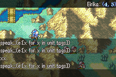

# Debugger

The debug screen is accessible via the `debug` menu item (in the on-map option menu - the one which normally contains `UNITS`, `OPTIONS`, `END TURN`, etc.), if launching the game in debug mode.

If not, the debug screen is still accessible via the same menu, but the player must enter the following code, using directional input keys, to open it: `UP, UP, DOWN, DOWN, LEFT, RIGHT, LEFT, RIGHT`.

 

The debug screen calls a miniature event when you enter a command. That event has access to:
> - **unit**: the unit under the cursor
> - **position**: the position under the cursor

You can see these values displayed on the top right corner of your screen, as seen in the above screenshot. No unit will be displayed when not hovering over a unit.

While in this menu, you may type in any event command and hit `Enter` to have that event command be immediately executed. Try out `give_item;Eirika;Vulnerary` as an example.

To exit the Debug menu, press `Enter` while there is no text in the debug command line. Do not press `Escape` or your game window will close entirely.