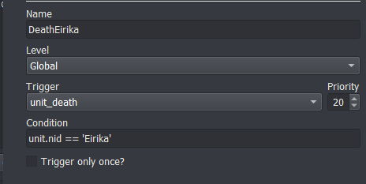
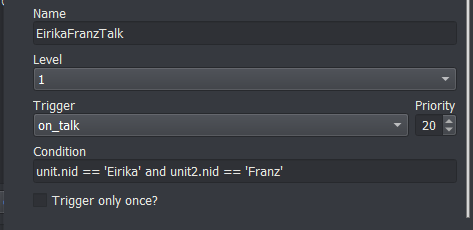
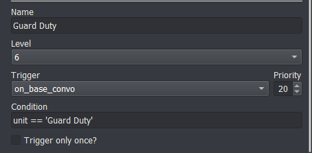

# Miscellaneous Events

_last update v0.1_

## Death Events

The `unit_death` trigger fires whenever ANY unit dies. You can create events that happen when a certain unit dies by catching this trigger with the right condition.

For instance, to create a death quote for Eirika's death and then cause the player to game over:

Condition: `unit.nid == 'Eirika'` (We only want Eirika's death to trigger this event)

Event Commands:
```
u;Eirika;FarRight
s;Eirika;Brother... I'm sorry
expression;Eirika;CloseEyes
r;Eirika
remove_unit;Eirika
lose_game
```



## Fight Events

To create fight quotes that happen before fighting (for instance, before fighting a boss), you can use the `combat_end` trigger. It fires whenever ANY interaction between units happens. So you will need to set up the right condition to make sure your event only happens at the right time.

### Basic Fight Quote
When the boss has only one quote that they say the first time they enter combat, you can check whether either unit is the boss. Make sure the "Only Once" box is checked, otherwise this event will fire everytime the boss is in combat.

`unit.nid == 'Lyon' or unit2.nid == 'Lyon'`

### Basic Fight Quote+
If the boss could be healed or otherwise supported by his fellows, you will want to make sure that the boss only says his lines when fighting your characters.

`(unit.nid == 'Lyon' and unit2.team == 'player') or (unit.team == 'player' and unit2.nid == 'Lyon')`

### Specific Fight Quote
If the boss has a specific fight quote for a specific unit, you can use a special function to check whether the boss is in combat with that unit.

`check_pair('Lyon', 'Eirika')`

### Default Fight Quote
If the boss has a specific fight quote for certain units, but a default fight quote used for all other combatants, you can use another function to check whether the boss should be using the default. The second argument to `check_default` should be a list of the characters that the boss has a specific fight quote for.

`check_default('Lyon', ['Eirika', 'Ephraim'])`

For all of these events, make sure to check the "Only Once" box so they only occur once (otherwise they'd get quite repetitive).

## Talk Conversations

The first step for talk conversations is to set up a potential talk conversation. You tell the engine you'd like two characters to be able to talk to one another.

I like to put my setup at the top of the `level_start` event for the chapter, so I'd write:

```
add_talk;Eirika;Franz
add_talk;Seth;Franz
```

This sets up a one way talk opportunity between Eirika and Franz, and between Seth and Franz. The first character is the one that initiates the conversation. If you want either character to be able to initiate, just add it twice, but with the characters reversed.

```
add_talk;Eirika;Franz
add_talk;Franz;Eirika
```

Once that has been done, you can write the actual conversation that will occur when the player actually selects **Talk**.

Create an event with the `on_talk` trigger, and write the content of the conversation in the event. Since `on_talk` fires for every talk, if you have more than one talk conversation per level, you can specify which units are the ones talking in the conditional. For a conversation that Seth initiates with Franz:

`unit.nid == 'Seth' and unit2.nid == 'Franz'`



## Base Conversations

Base conversations are very similar to Talk conversations in overall structure. You set up a base conversation by deciding on the name of the base conversation that will appear in the Base Convos menu. Then at the beginning of the level, use the `add_base_convo` command to tell the engine that this is an available base conversation

`add_base_convo;Guard Duty`

Create an event with the `on_base_convo` trigger, and write the content of the conversation in the event. Since `on_base_convo` fires for every base conversation, you need to narrow it down to the specific base conversations you'd like this event to fire for. For the `Guard Duty` base conversation, you set the condition to:

`unit == 'Guard Duty'`

At the end of the base conversation, you can use the `ignore_base_convo` or `remove_base_convo` commands to either gray out the base conversation in the menu, or remove it altogether.


