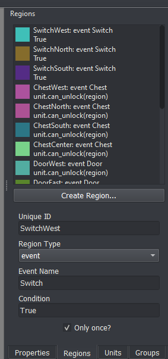
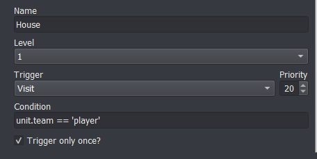
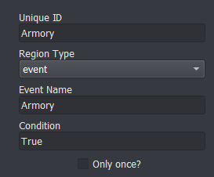
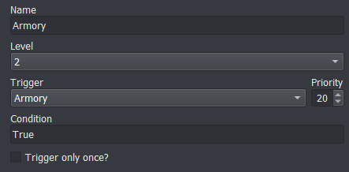
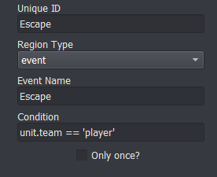
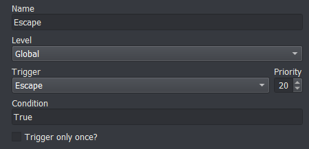
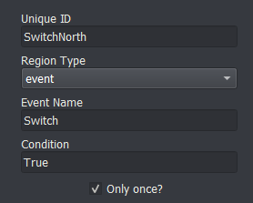
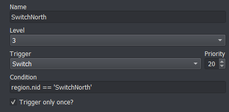
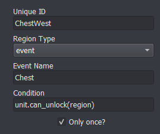
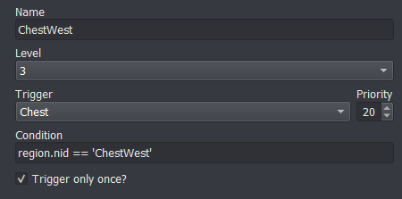

# Region Events

_last update v0.1_



Event regions are a flexible way for the game designer to give the player additional actions their characters can perform while on specific regions of the map. With event regions, you can implement visiting villages, visiting shops, seizing thrones, escaping the map, flicking switches, and unlocking chests or doors, and much more.

The condition box in the Region pane allows you to specify which units will be able to access that region's action. For instance, if you only want Eirika to be able to Seize, you can set the condition to `unit.nid == 'Eirika'`.

## Villages / Houses




The condition in the Event Editor specifies *which* region this event corresponds to.

A normal visit event looks something like this

```
transition;Close
change_background;House
transition;Open
add_portrait;{unit};Left;no_block
add_portrait;Man;Right
speak;Man;You'll never defeat Gharnef!
remove_portrait;{unit};no_block
remove_portrait;Man
transition;Close
change_background
transition;Open
give_item;{unit};Red Gem
has_attacked;{unit}
```

The `has_attacked` command at the end is important if you don't want the unit to be able to move or attack after visiting the village

## Shops / Armories





A normal shop event looks something like this

```
transition;Close
music;Armory Music
shop;{unit};Iron Sword,Iron Lance,Iron Axe
transition;Open
```

The `shop` command handles all the intricacies of shopping for you, including making sure the unit can't move back after making a transaction.

## Seize

A normal seize event looks something like this

```
win_game
```

## Escape





A normal escape event looks something like this

```
remove_unit;{unit}
wait;400
if;not any(unit.team == 'player' for unit in game.units if unit.position)
    win_game
end
```

## Switch





You can increment a counter every time a switch event is processed if you want to keep track

## Chest / Door





A normal chest event looks something like this

```
show_layer;Chest1
unlock;{unit}
give_money;2000
has_attacked;{unit}
```

The unlock command handles spending the unlockable you used to unlock the chest (whether that be by a key, lockpick, or with locktouch)
