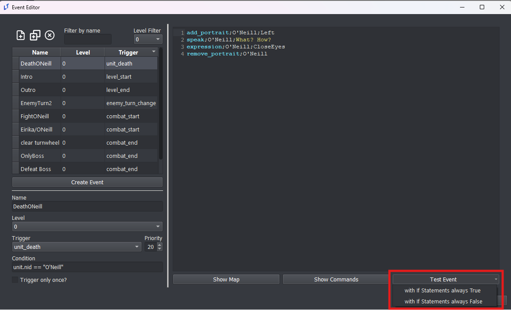
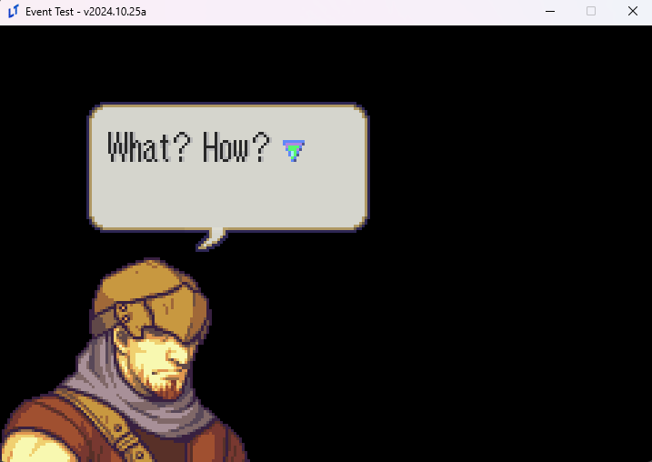
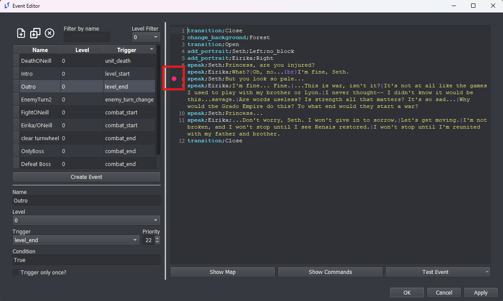
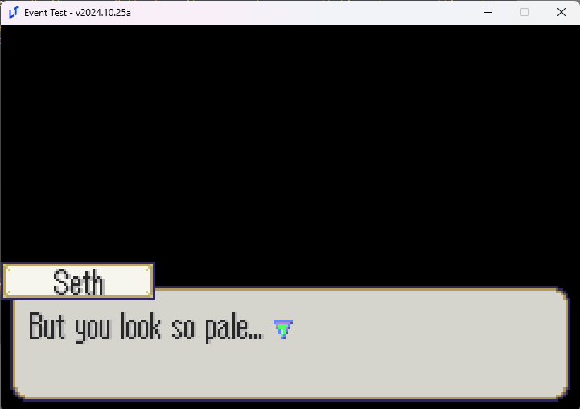

# Test Events

You can test your events from the Events Editor without having to test your full game.

Simply press the Test Event button and then choose how you want your conditional `if` statements to be automatically resolved.



## What's different about Test Events?

Many different commands **will not run** in a test event! In fact, most event commands will not be processed and just skipped.

These are the **ONLY** commands that will run:
```
"if"
"elif"
"end"
"for"
"endf"
"finish" 
"wait"
"end_skip"
"music"
"music_clear"
"sound"
"stop_sound"
"add_portrait"
"multi_add_portrait"
"remove_portrait"
"multi_remove_portrait"
"move_portrait"
"mirror_portrait"
"bop_portrait"
"expression"
"speak_style"
"speak"
"unhold"
"transition"
"change_background"
"table"
"remove_table"
"draw_overlay_sprite"
"remove_overlay_sprite"
"location_card"
"credits"
"ending"
"paired_ending"
"pop_dialog"
"narrate"
"toggle_narration_mode"
"unpause"
"screen_shake"
```

In addition, you do not have access to any actual units or the game map. If you want access to these, just test your event using the real "Test Chapter" button in the editor. If you try to run a command that requires the map or actual units to exist in memory, it may skip the command or even crash.

This means the Test Event button is best used for testing your dialogue scenes that don't rely on the map.



## Test Event at a Specific Point

If you don't want to test the full event, you can instead test the event at a specific point by clicking on the line number pane.



Once this symbol appears, now when you test your event, it will start from that specific line.



Because the previous lines were never run, Seth's portrait does not show up here.
