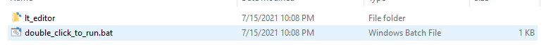
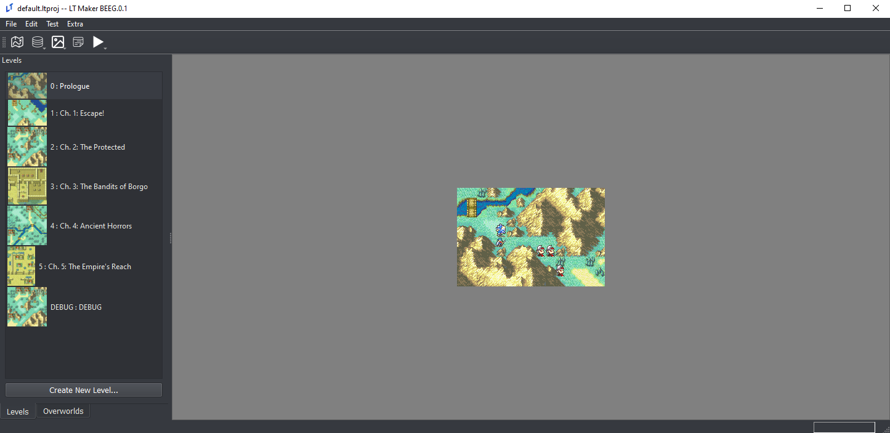
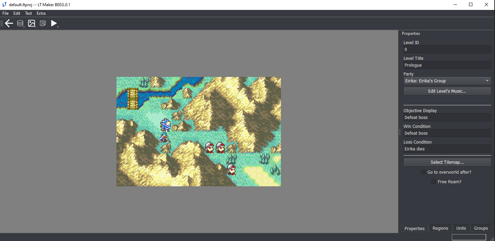
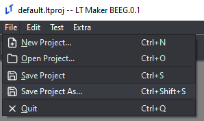

(Getting-Started)=
# Getting Started

If you have experience working with Python and want to use the Python version of the **Lex Talionis** engine and editor, check out the [Python Installation](PyInstall) guide in the sidebar. Otherwise, read on.

The Windows executable version of the **Lex Talionis** editor can be downloaded at this link:  [https://gitlab.com/rainlash/lt-maker/-/releases](https://gitlab.com/rainlash/lt-maker/-/releases)

**MAKE SURE YOU DOWNLOAD THE FILE TITLED LEX_TALIONIS_MAKER**

This executable will **ONLY** work on Windows. On Mac and Linux you must follow the Python Installation method linked above. Once you have downloaded and unzipped the file, locate the `double_click_to_run.bat`. Double-click it to run the editor.

**warning: IF YOU DOWNLOAD THE WINDOWS EXECUTABLE VERSION YOU DO NOT NEED TO PROCEED WITH ANY OTHER INSTALLATION STEPS.**

After a couple of seconds, the editor should pop up.

The editor comes with some pregenerated data in the default project (specifically, the first six chapters of the Sacred Stones). It is expected that you will modify this data to create your own game.

1. Currently open project

2. Databases: these contains the game-wide data, like the classes, units, items, and skills that you will have in your game

3. Resources: these contain additional image or sound resources necessary to bring your game to life, like portraits, backgrounds, tilemaps, and music

4. Events: Here you can create custom events to make your game experience unique. More information can be found at [Event Overview](EventOverview).

5. Testing: Options for testing your game

6. Level Select: Here is where each of the chapters in your game live

7. Check for updates and modify certain editor preferences

## Level Editor

If you double-click a specific level, it will start the Level Editor mode of the editor. Here you can work specifically on the level itself.

1. Go back to the Global Editor mode

2. Level Properties tab (start here when you create a new level)

3. Define and place units on the map

4. Define special regions on the map (events, status effects, formation placement, etc.)

5. Set up groups of units (generally used with events)

## Saving your project

If you've made changes to the default project, you can save your changes easily as a new personal project of your own. Just click **File->Save as...** and give your project a name. The engine will append the *.ltproj* suffix onto the end of your project folder during the save process. You can then open this project at any time to resume your work.

> Don't save your project as `default` or `autosave`. These projects are already used in the editor.

## Updating the Engine (Executable)

New releases of the Lex Talionis Engine come out regularly. If you want to update to a new version, navigate to the same place you downloaded the engine in the first place: [https://gitlab.com/rainlash/lt-maker/-/releases](https://gitlab.com/rainlash/lt-maker/-/releases). Then, just download the latest release. You can start the newly downloaded engine and open your .ltproj just the same as the previous version you had. Feel free to discard the old version.

## Next Steps

This wiki contains some helpful guides but does not and cannot cover every possibility available to you with the editor. Visit the [Lex Talionis Discord Server](https://discord.gg/dC6VWGh4sw) for more help if necessary.
