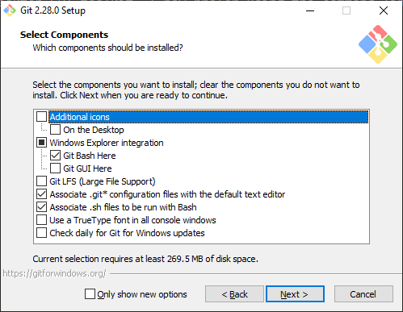
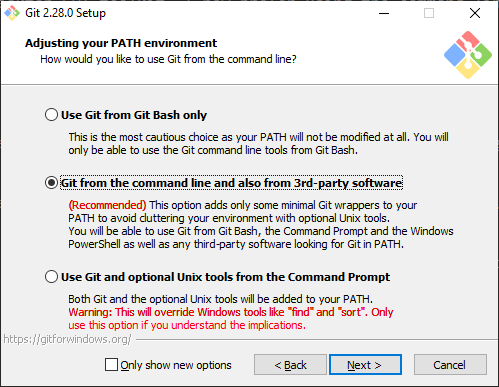
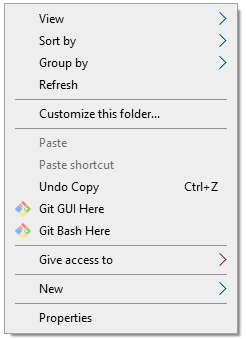
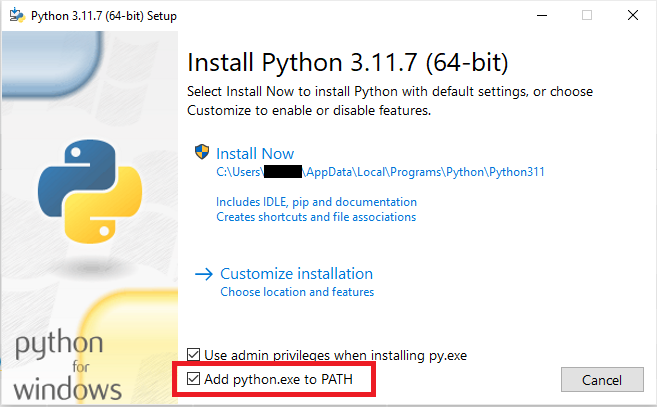
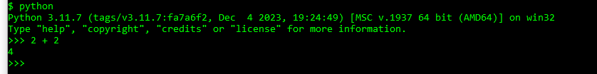
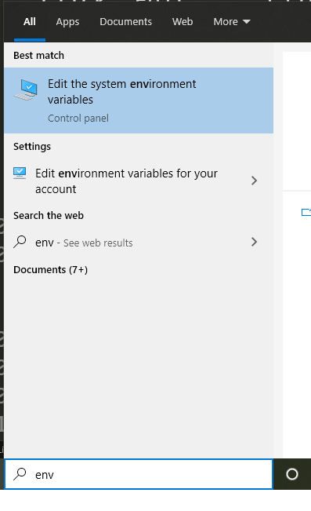
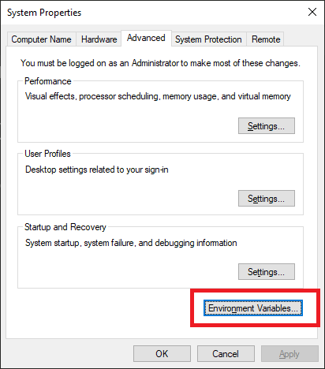
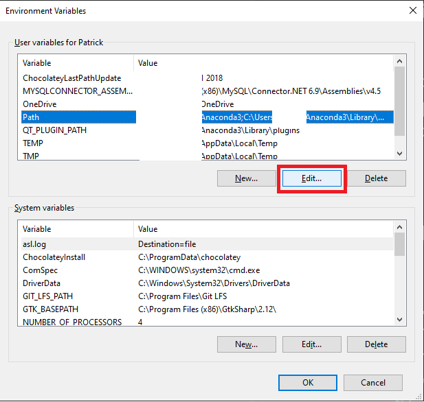
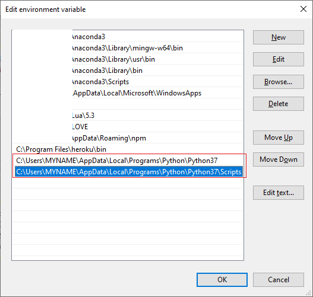
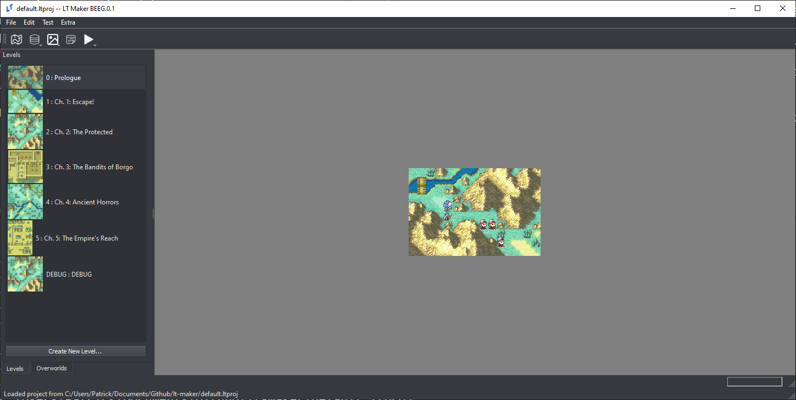

(PyInstall)=
# Necessary Installs (for Windows)

## How to install Git, Python, Pip, Pygame, and PyQt from scratch on a Windows machine

> Make sure before installing any of these, that you've uninstalled any previous versions of these tools from your machine.
Having multiple version of Python on your machine can be a major headache.

## Installing Git

Although I started using git with the Github Desktop GUI toolkit, I now prefer using the command line version, and that is the version that will be installed here.

https://git-scm.com/download/win

## Installation Process

If I don't mention a specific screen, just use the defaults provided.



I recommend this setup for first time git users. Being able to access "Git Bash" from right clicking on the explorer menu is invaluable, but Git GUI is rather useless. You shouldn't need Git LFS for this project.

Make sure you change the text editor to your text editor of choice. I recommend Sublime Text Editor, although many other good text editors exist (Notepad++ is another lightweight editor)

Choose the second option under "Adjusting your PATH Environment", unless you are sure you never want to use git outside of Git Bash (if so, choose the first).



Choose the defaults for the remaining options, unless you have a good reason not to.

Now git should be installed.

## Testing

Let's make sure git works.

You should be able to right-click in the File Explorer and open Git Bash by left-clicking "Git Bash"



A command line terminal should pop up.

Type `git --version` to make sure git responds.

Then navigate to where you want the engine to live and type

```
git clone --depth=1 https://gitlab.com/rainlash/lt-maker.git
```

This will clone the repository to your machine, where you'll have access to it.

## Installing Python

<span style="color: red; font-weight: bold;">Use python version 3.11 only, instead of latest version.</span>

https://www.python.org/downloads/release/python-3117/

Navigate down to "Files" on that webpage and click "Windows installer (64-bit)" (assuming you have a 64-bit Windows machine).

The download should start automatically, then run the installer executable.

I highly highly **HIGHLY** recommend adding Python 3.11 to PATH. This makes so many of the errors that new users of Python run into just disappear. Make sure to click that check box. Then, click "Install Now". the default installation options should be fine.



Now you should have Python installed on your machine. Open a new Git Bash somewhere on your machine and type `python --version` or `py --version` or `python3 --version` to confirm that Python works.

Whichever one works (`python` or `py` or `python3`) will be the command you will use in the future to call Python. In the rest of this tutorial, I will be using `python` because that is how it is on my machine, but if `py` or `python3` works for you, use that one instead.

## Python Overview

You can type just `python` on the Git Bash command line to get the interactive Python REPL, which lets you enter in python commands interactively. For instance, typing in "2 + 2" gives you...



To run a Python script, just type `python` and then the script's file name. You must be in the same directory as the script, otherwise you must give python the relative path to the script.

This means that in order to run python scripts in the lt-maker directory, you should run python from within the lt-maker directory.

<details><summary><strong>Python Command Not Found</strong></summary><p>

If the python command is not found, and you didn't add Python to your PATH during installation, you will need to update your PATH so that Windows knows where Python lives.

Newer versions of Python like the one you installed generally live in `C:\Users\{Your User}\AppData\Local\Programs\Python\Python311`

If you navigate to there, you should see a python.exe executable. This is the actual python you would be running if the PATH was set up correctly.

In Windows 10, type "env" in the search bar and click the "Edit the System Environment Variables" option.



A dialog box will pop up. Click "Environment Variables...".



Under User Variables (the top table), click on the "Path" row, then click "Edit...".



Click "New" on the right. Type the location of your Python executable, in this case: `C:\Users\{Your User}\AppData\Local\Programs\Python\Python31`. Hit Enter. Click New again and type in the path to the associated Scripts directory. `C:\Users\{Your User}\AppData\Local\Programs\Python\Python31\Scripts`.



Now click OK, exit out of the whole thing, and open a new Git Bash. Try running `python --version` again, and your Python should work now.

---
</p></details>

## Installing Pip

Pip is the Python package manager. It means from here on out, we don't need to download stuff off random websites to get the rest of our tools. These days, if you install Python with the defaults, pip comes bundled with Python.

Make sure it's available by typing
```
pip --version
```
or
```
python -m pip --version
```
in the command line.

> If during any of the installations, you find that you need administrator privileges to install for all users, you can install for just yourself with `pip install {package_name} --user`.

## Installing Requirements

```
pip install -r requirements_editor.txt
```
 or
```
python -m pip install -r requirements_editor.txt
```

Wow, that was easy. It should've installed, along with all other dependencies.

Test if it works

```
python -m pygame.examples.aliens
```

Now test if the engine works by typing
```
python run_engine.py
```
from within the "lt-maker" directory.

The engine main screen should pop up and you should be able to play the Lion Throne.


Now test if LT-Maker works by typing
```
python run_editor.py
```
from within the "lt-maker" directory.

The editor should pop up and you should be able to begin making your own fangame.



> Some users have reported that on Linux systems (specifically Ubuntu), PyQt5 installation does not work. In that case, try: `sudo apt-get install python3-pyqt5` instead.

Once installed, you can follow the second part of the [Build Engine](Build-Engine) guide to distribute your project as an executable.

## Updating the Engine (Python/Git)

If you are using Git and Python to download and run the engine, updating the engine is simple.

When changes are made to the Lex Talionis Engine, you can update to the newest changes by typing `git pull` in Git Bash while within your "lt-maker" directory. This will pull the newest changes from the git repo on Gitlab and automatically add them to your installation.

If you've made significant changes to the engine code itself, and `git pull` no longer works well for you, ask around on the Discord for advice.
