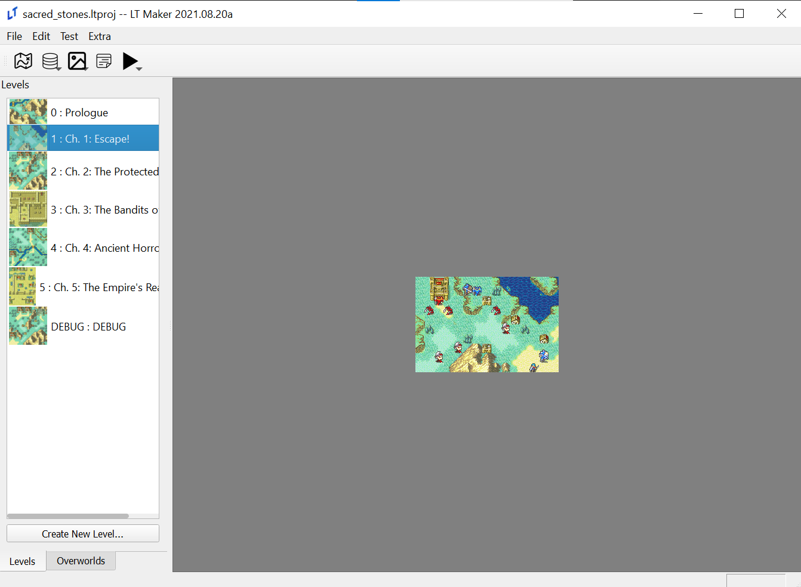
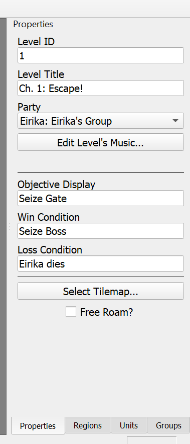
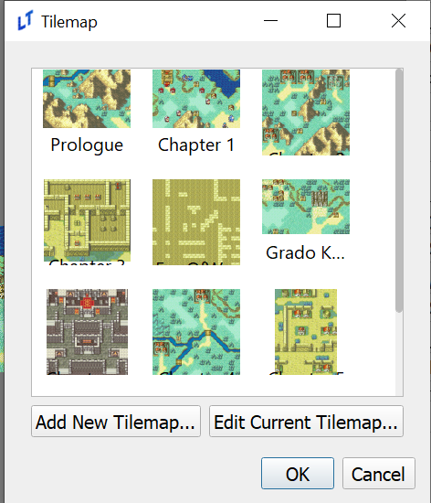
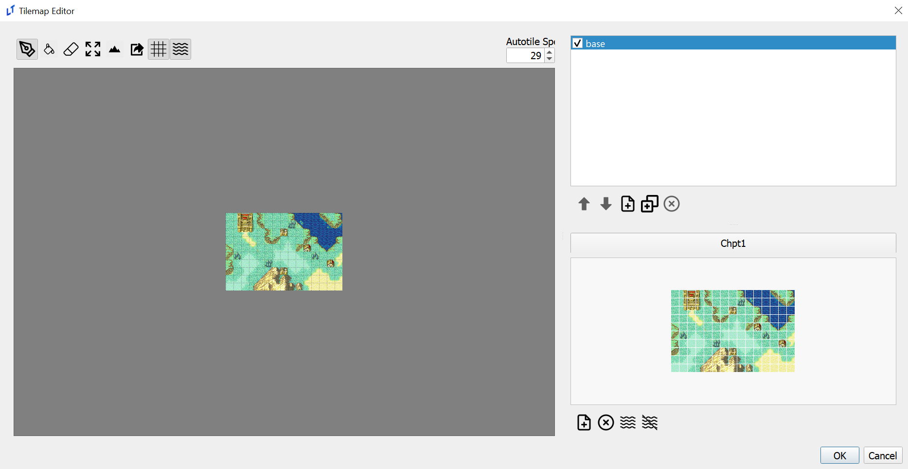
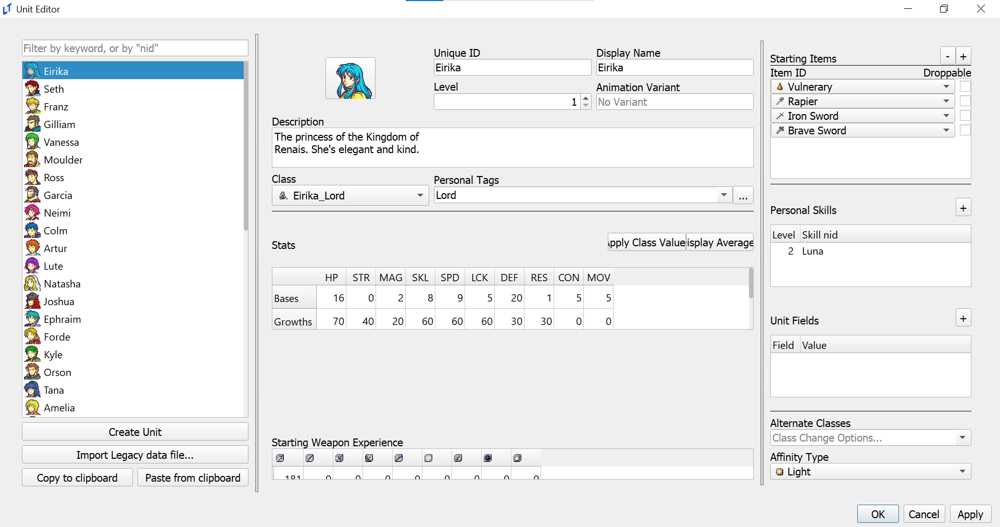
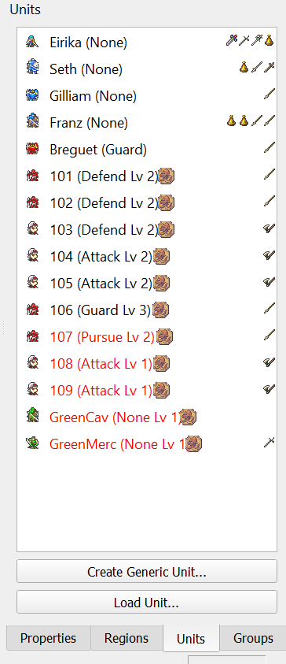
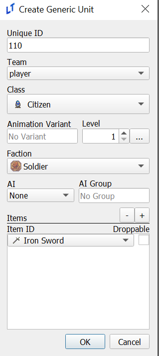
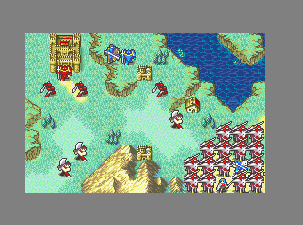

# The Basics

Due to the sheer amount of editors available in Lex Talionis it can be very easy to become overwhelmed when first starting out. This page will provide a short guide on how to learn some of the essentials of any LT game - interacting with level properties, editing the map, and making and placing units.

First, go to "File" in the top left corner and select the sacred_stones.ltproj folder in the window that appears.

Your window should now look like this: 

Double click on chapter 1 to open the level editor. The right side of the window should now look like this:

We'll go through each piece of information, starting from the top.

1. Level ID - The level's number in the context of your game. It's not that important, just make sure not to have two levels with the same ID.
2. Level Title - This is the name the player sees when the chapter starts
3. Party - If you were using split parties, like in Sacred Stones or Gaiden, this would be useful. Ignore it for now.
4. Music - This button opens a new screen where the level's music can be changed. You can open it if you want, but it isn't immediately relevant.
5. Objective Display, Win Condition, Loss Condition - All three of these have self-explanatory names, but it's important to remember that these aren't _actually_ what determines the win and loss condition. They only determine what the player sees in the chapter. The win and loss condition are determined through the win_game and lose_game commands in events. See the events section for more details.
6. Select Tilemap - This button would allow us to select and edit the map itself. We'll click it in just a second.
7. Free Roam? - This toggles the engine's free roam feature in the context of this level. Free Roam works identically to Fates' My Castle or Three Houses' Monastery, but can be set at the start of the level as well as changed partway through it.

Now that we've gone through these options, click "Select Tilemap". That'll open a window that looks like this:

 

Select the image above Chapter 1 and choose "Edit Current Tilemap". That will open the tilemap editor. 

The window on the left side is your map preview. The box in the top right, currently with base highlighted and checked, is your layer selection. The map in the bottom right is your tileset. Left click on a tile in the tileset and then left click on the map. Voila, the map has changed!

Now we'll add terrain to the map. Move your mouse to the top icons and click the icon that looks like a mountain. A new bar will appear on the left and the map will look quite colorful. Scroll through that bar and look at the options currently available. More options can be added in the terrain editor, but for now choose one and left click a few times on the map. You should see that the terrain has now changed.

Let's run a quick test. Hit "ok" in the Tilemap Editor, "ok" in the other pop-up screen, and then hit F5. That will run the currently selected chapter. Whatever changes you made should now appear on the map!

Finally, we'll look at making and placing units. In the top left of the main window, click "Edit" and "Units". This will bring up the Unit editor. 

There's a lot of information here, but most is self explanatory. Try messing around with Eirika's stats or class, and maybe give her a few weapons. Remember, both the character and their class must be able to use a weapon type!

Once you're done hit "Apply" and go back to the level editor. Click the "Units" tab in the bottom right.

You can see a list of unit icons, names, and items. Each unit has a word in parentheses next to their names, which corresponds to their AI typing. Player units always have None for AI, while units here have a mix of guard and defend. From Meinerieve:

1. Pursue: Hunt you down across the map.
2. Attack: If I can move and attack this or next turn I will
3. Defend: Only attack what comes into my range
4. Guard: Don't move but will attack if in my item range.

Double clicking on one of these units will show information about them, which is especially helpful for red and green generic units. Once one is selected, right click to move them on the map.

Finally, let's create a unit. Click the "Create Generic Unit" button at the bottom.

You can see a lot of information here, but it's largely the same as the Unit editor. The key difference is that the unit will be able to use any weapon you give them so long as their class can, and that you can't directly change these units' stats. Instead, they take their class average values at their level, plus any difficulty modifiers given to them.

If you click on "Team" you can see four options. Most are self explanatory, but it's worthwhile to highlight enemy2, which are purple units that attack both red, green, and blue units. Anyway, go ahead and make a few, placing them down to block Eirika's path. You'll notice that it saves your last settings each time you go to make a new generic unit, making placing down a whole lot of enemies quite easy!

Mwahaha!

This is the end of our starter tutorial. You should now have all the tools you need to create basic maps in Lex Talionis, as well as create characters for them. As you dive deeper into the engine you'll certainly encounter more challenges and have more questions. The Lex Talionis discord is the perfect place to ask them, and hopefully this wiki will be able to provide you with some answers as well.