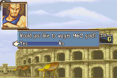
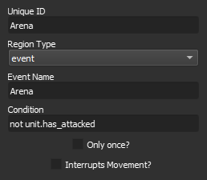
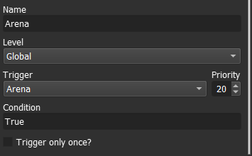
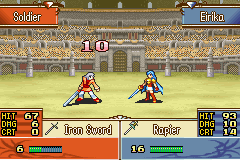

# GBA-style Arena

*last updated 22-01-31*



This tutorial will explain how to create an arena where your units can fight, earn experience and money, and potentially die. In this guide, an arena based off the Fire Emblem GBA games will be created, but the features shown here are powerful enough to create significantly different variants on the base idea.

These relatively new event editor features give you, the game designer, significant freedom in creating all sorts of choices and menus that you can show the player. This means we can create a version of the GBA arena without actually touching any Python code.

## Prerequisites

It is expected that you, the reader, are already familiar with [A Simple Mercenary Shop Guide](A-Simple-Mercenary-Shop). If you aren't, you may find it useful to understand that guide before diving into this one.

## Setting up the event

First, in your level, create an "event" region with sub_nid "Arena".



Now, in the event editor, create a new global event called "Arena". Set the trigger to "Arena". You can leave the condition as "True", since any unit can use the arena.



You now have an arena event, but nothing happens when you step in the ring. Let's fix that. We need to start by determining the class, weapon, level, and stats of the enemy you will face in the arena. This will be a lot of setting up and saving variables as we slowly narrow down the choice of enemy.

First, fade to black

`t;close`

Then, determine your own class and save it to a variable.

`level_var;EntrantClass;DB.classes.get(unit.klass)`

Determine the enemy classes that are in your tier. We don't want promoted units fighting unpromoted units or vice versa.

`level_var;ArenaEnemyKlassList;[k.nid for k in DB.classes if 'ArenaIgnore' not in k.tags and k.tier == game.level_vars['EntrantClass'].tier]`

Pick one at random.

```
level_var;KlassRNG;game.get_random(0, len(game.level_vars['ArenaEnemyKlassList']) - 1)
level_var;ArenaEnemyKlass;game.level_vars['ArenaEnemyKlassList'][game.level_vars['KlassRNG']]
```

Now assign the enemy a random level, but make sure that it's close to our entrant's level. I decided to choose a random level within 4 levels of our entrant's level, making sure the level isn't below 1 or above the maximum allowed for the class.

```
level_var;low_level;max(1, unit.level - 4)
level_var;high_level;min(DB.classes.get(game.level_vars['ArenaEnemyKlass']).max_level, unit.level + 4)
level_var;ArenaEnemyLevel;game.get_random(game.level_vars['low_level'], game.level_vars['high_level'])
```

Now we need to decide, based on the level chosen, what the player's wager must be in order to buy entry to the arena. We compare the chosen level against the range of levels that were possible to pick. If it's closer to the high end, then the wager will also be on the high end. I set my lowest wager possible to 550 and my highest wager possible to 1100. I also set it so that if the player has less than 550 gold, they are still able to enter the arena by using all their money.

```
level_var;ArenaPercent;(game.level_vars['ArenaEnemyLevel'] - game.level_vars['low_level']) / float(game.level_vars['high_level'] - game.level_vars['low_level'])
level_var;ArenaWager;int(min(550 + game.level_vars['ArenaPercent'] * (1100 - 550), game.get_money()))
```

Next, we need to give our enemy a valid weapon they can use. It would be no good if a Fighter shows up to the arena with an Iron Lance he can't wield. We investigate what kinds of weapons their class can wield and pick from among the valid weapon types the one with the highest weapon experience. This will crash if it picks a class that can't wield any of the weapon types, so make sure you mark those classes with the "ArenaIgnore" tag in the class editor beforehand.

```
level_var;ArenaWexpGain;DB.classes.get(game.level_vars['ArenaEnemyKlass']).wexp_gain
level_var;ArenaItemDict;{'Sword': 'Iron Sword', 'Lance': 'Iron Lance', 'Axe': 'Iron Axe', 'Bow': 'Iron Bow', 'Staff': 'Heal', 'Light': 'Lightning', 'Anima': 'Fire', 'Dark': 'Flux'}
level_var;ArenaWexpGainMaxNid;max(game.level_vars['ArenaWexpGain'].items(), key=lambda x: x[1].wexp_gain)[0]
level_var;ArenaItem;game.level_vars['ArenaItemDict'][game.level_vars['ArenaWexpGainMaxNid']]
```

Now we actually instantiate the unit and their weapon. We add the unit to the closest valid position nearby our arena entrant.

```
make_generic;;{var:ArenaEnemyKlass};{var:ArenaEnemyLevel};enemy
add_unit;{created_unit};{unit};immediate;closest
give_item;{created_unit};{var:ArenaItem};no_banner
```

Finally, we can ask the player whether they actually want to fight. We set up the menus and display boxes now.


```
change_background;Arena
draw_overlay_sprite;Dialogue;menu_bg_clear;-4,8;0
draw_overlay_sprite;ArenaPortrait;arena_portrait;4,4;1
table;GoldDisplay;[game.get_money()];;;60;right;funds_display;;center;expression
# Fade to arena background
t;open
```

Check if the unit has a weapon and wants to wager the amount of gold we determined in the processes above. If so, take their money and start the fight. You'll see that in the interact_unit command, we have the player unit fight the created unit, in that order, so the player unit goes first. We also set up the "arena" flag so the player can press B between combat rounds to leave the combat early, forfeiting their wager. The "20" indicates the maximum number of rounds that will occur. Lastly, the "force_animation" flag forces the player to watch the animation if one exists, even if they otherwise have animations turned off. This is to hide the fact that the enemy unit was just spawned somewhere nearby, and to give the player a chance to press B between combat rounds.

If the player unit doesn't have a weapon or they refuse the wager, we just tell them to get out of here.

```
if;unit.get_weapon()
    choice;ArenaChoice;Would you like to wager {var:ArenaWager} gold?;Yes,No;;horizontal
    if;game.game_vars['ArenaChoice'] == 'Yes'
        sound;GoldExchange
        give_money;{eval:-game.level_vars['ArenaWager']};no_banner
        speak;;Good luck. Don't get yourself killed.;60,8;160;clear
        t;close
        interact_unit;{unit};{created_unit};;;20;arena;force_animation
        if;created_unit.is_dying or created_unit.dead
            t;open
            s;;So you won, eh? Here's your prize. {eval:2*game.level_vars['ArenaWager']} gold.;60,8;160;clear
            sound;GoldExchange
            give_money;{eval:2*game.level_vars['ArenaWager']}
            wait;200
        end
        has_attacked;{unit}
    else
        s;;What are you wasting my time for?;60,8;160;clear
    end
else
    s;;What! You don't have a weapon! Get out of here!;60,8;160;clear
end
t;close
```



Now make sure to clean up after yourself. Remove the created unit from the game. Also remember to remove the overlay sprites and tables you created.

```
change_background
remove_unit;{created_unit};immediate
rmtable;GoldDisplay
remove_overlay_sprite;Dialogue
remove_overlay_sprite;ArenaPortrait
t;open
```

Congrats! You have now successfully implemented the GBA Arena. It's not perfect yet as the special UI commands are still missing a couple of small features, but the functionality is complete. Feel free to modify the event code above to meet your own special arena requirements.

## Reference

Here is the full code used in this tutorial:

```
# GBA style arena
transition;Close
# Determine Enemy's class, level, and item, along with associated Wager
level_var;EntrantClass;DB.classes.get(unit.klass)
level_var;ArenaEnemyKlassList;[k.nid for k in DB.classes if 'ArenaIgnore' not in k.tags and k.tier == game.level_vars['EntrantClass'].tier]
level_var;KlassRNG;game.get_random(0, len(game.level_vars['ArenaEnemyKlassList']) - 1)
level_var;ArenaEnemyKlass;game.level_vars['ArenaEnemyKlassList'][game.level_vars['KlassRNG']]
level_var;low_level;max(1, unit.level - 4)
level_var;high_level;min(DB.classes.get(game.level_vars['ArenaEnemyKlass']).max_level, unit.level + 4)
level_var;ArenaEnemyLevel;game.get_random(game.level_vars['low_level'], game.level_vars['high_level'])
level_var;ArenaPercent;(game.level_vars['ArenaEnemyLevel'] - game.level_vars['low_level']) / float(game.level_vars['high_level'] - game.level_vars['low_level'])
level_var;ArenaWager;int(min(550 + game.level_vars['ArenaPercent'] * (1100 - 550), game.get_money()))
level_var;ArenaWexpGain;DB.classes.get(game.level_vars['ArenaEnemyKlass']).wexp_gain
level_var;ArenaItemDict;{'Sword': 'Iron Sword', 'Lance': 'Iron Lance', 'Axe': 'Iron Axe', 'Bow': 'Iron Bow', 'Staff': 'Heal', 'Light': 'Lightning', 'Anima': 'Fire', 'Dark': 'Flux'}
level_var;ArenaWexpGainMaxNid;max(game.level_vars['ArenaWexpGain'].items(), key=lambda x: x[1].wexp_gain)[0]
level_var;ArenaItem;game.level_vars['ArenaItemDict'][game.level_vars['ArenaWexpGainMaxNid']]
# Actually instantiate unit
make_generic;;{var:ArenaEnemyKlass};{var:ArenaEnemyLevel};enemy
add_unit;{created_unit};{unit};immediate;closest
give_item;{created_unit};{var:ArenaItem};no_banner
# Now move to Arena
change_background;Arena
draw_overlay_sprite;Dialogue;menu_bg_clear;-4,8;0
draw_overlay_sprite;ArenaPortrait;arena_portrait;4,4;1
table;GoldDisplay;[game.get_money()];;;60;right;funds_display;;center;expression
# Fade to arena background
transition;open
if;unit.get_weapon()
    choice;ArenaChoice;Would you like to wager {var:ArenaWager} gold?;Yes,No;;horizontal
    if;game.game_vars['ArenaChoice'] == 'Yes'
        sound;GoldExchange
        give_money;{eval:-game.level_vars['ArenaWager']};no_banner
        speak;;Good luck. Don't get yourself killed.;60,8;160;clear
        transition;close
        interact_unit;{unit};{created_unit};;;20;arena;force_animation
        if;created_unit.is_dying or created_unit.dead
            transition;open
            speak;;So you won, eh? Here's your prize. {eval:2*game.level_vars['ArenaWager']} gold.;60,8;160;clear
            sound;GoldExchange
            give_money;{eval:2*game.level_vars['ArenaWager']}
            wait;200
        end
        has_attacked;{unit}
    else
        speak;;What are you wasting my time for?;60,8;160;clear
    end
else
    speak;;What! You don't have a weapon! Get out of here!;60,8;160;clear
end
transition;close
# Clean up
change_background
remove_unit;{created_unit};immediate
rmtable;GoldDisplay
remove_overlay_sprite;Dialogue
remove_overlay_sprite;ArenaPortrait
transition;open

```