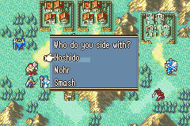
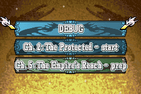

# Choices and Battle Saves

_last updated v0.1_

## Choices

You can give the player a choice in an event. This is done through the use of the `choice` command.

The choice command takes in three required arguments:

1. The name of the choice
2. The choice text or question
3. A comma-delimited list of available options

Example:
`choice;fates;Who do you side with?;Hoshido,Nohr,Smash`



The choice that the player chooses will be saved in the game_vars under the name you gave the choice. The most recent choice made is also saved in game_vars under `_last_choice`. So you can access their choice with `game.game_vars['fates']` or `game.game_vars['_last_choice']`. 

```
if;'{v:_last_choice}' == 'Smash'
    u;Corrin;Left
    s;Corrin;I choose to SMASH!
    r;Corrin
end
```

## Battle Saves

Battle saves give the player the opportunity to make a save while in the middle of a chapter. You can use this to give the player a save after completing a tough objective. Or perhaps you give the player the opportunity to battle save only at the beginning of every fifth turn. Or you have certain save point regions that when activated allow the player to save the game. There are lots of possibilities.



The `battle_save` event command tells the engine to create a battle save after the event is complete. 

You can give the player a choice too!

```
choice;battle_save;Would you like to save?;Yes,No;h
if;'{v:battle_save}' == 'Yes'
    battle_save
end
```