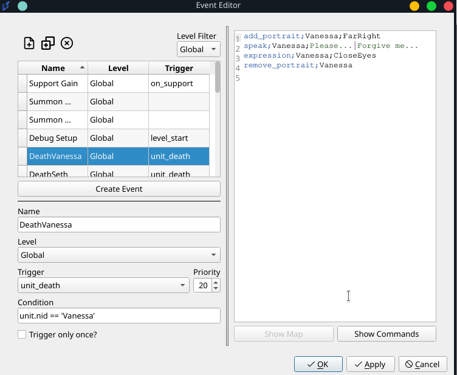

# Universal Death Quotes Tutorial

## Problem Description

I want to introduce death quotes into my game.

## Solution

There are two ways of going about this, both using events. One is on an individual level. The second is on a general level. Which solution you choose depends on how you wish to implement the death sequences in your game.

### Individual Solution

This solution already exists implemented in `default.ltproj`. This solution involves using an event that is triggered on the death of each unit. The event is as follows:



This event is fairly basic.

* It is a `global` event, meaning it can potentially trigger in any level.

* It triggers on `unit_death`, with a condition of `unit.nid == 'Vanessa'`, meaning that when the unit with NID "Vanessa" dies, this event will play.

* Technically, this event is not bound to trigger once, based on the `Trigger only once?` checkbox. But since units should only be dying once, it doesn't matter.

To sum, at any point in the game, if Vanessa dies, this event will play. The event is a very straightforward talk event. It will display Vanessa's portrait, play a dialogue, and then remove her portrait. But as they say, the sky's the limit. If you want extremely elaborate death sequences, that might involve multiple characters, giving items, whatever crazy thing you come up with, this is the solution for you. One drawback of this solution is that this requires a separate event for every single unit.

### General solution

The vast majority of the death quotes in the game will be much simpler, following the above format - the portrait flashes, the character says their dying line, and finally, the portrait disappears. The following event makes use of Unit Fields to reduce event count and simplify the process. It is as follows:


It's pretty much the same, except that there is no condition attached. This will trigger every single time a unit dies.

The meat of its functionality is in the eventing:

```
if;unit.get_field('DeathQuote')
    add_portrait;{eval:unit.nid};FarRight
    speak;{eval:unit.nid};{eval:unit.get_field('DeathQuote')}
    expression;{eval:unit.nid};CloseEyes
    remove_portrait;{eval:unit.nid}
end
```

For those who are unfamiliar with Unit Fields, I would recommend reading both the other tutorials and the [eval documentation](../../events/Conditionals). To put it simply, however, this will check if the unit that died possesses a field called `DeathQuote`, and if so, it will play a scene of the unit appearing, speaking the exact contents of their DeathQuote, and then disappearing - exactly the same as the above scene.

