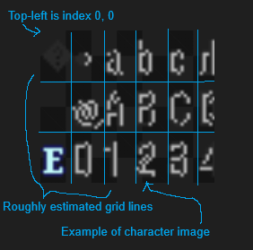
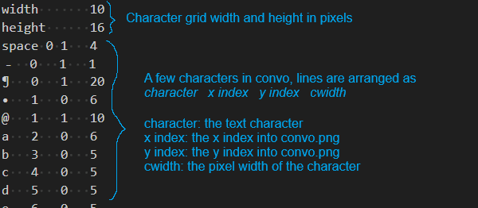
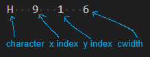
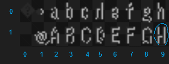

(Fonts-Guide)=
# Working with Fonts and Languages

If you wish to add a new font or modify existing fonts, you can do so by directly modifying the font files in your project. Adding language support for non-alphabetical systems works the same way.

## Where to find fonts

Under `<your_project.ltproj>/resources/fonts/` you will find two types of files: `.png` files and `.idx` files. These files are loaded into the engine at startup and are responsible for the text fonts that are available for you to use.

## What are PNG and IDX files?

PNG files are font character maps. These are essentially files that contain the character images that will be directly drawn onto the game screen. The characters in the file are lined up in a grid. When you create text in your game, the engine will open this file and fetch the corresponding character image in the PNG based on its location in the grid, also called its index. The text that it fetches corresponds to the text you have put in your game. The engine knows where each character is by looking at the IDX file. The IDX file contains information on the pixel width and height of each box in the PNG grid, a mapping of each character available for use to a grid index, as well as the width of specific characters so you can adjust your kerning.

## Anatomy of a PNG file



## Anatomy of a IDX file



## A worked example

In the default project, you will find convo as one of the available fonts. This font has its corresponding `convo.png` and `convo.idx` files, already shown in the above sections. When you have a line of text (called a string) such as "Hi" displayed in your game, the engine will look at each character in the string and then look in `convo.idx` to tell at which `x, y` indices it will find the character image in `convo.png`. It will then multiply these indices by the `width` and `height` found in `convo.idx` to get the exact top-left pixel location in `convo.png`. It will use the character image it finds at that location by directly drawing what it finds in a `height x cwidth` box.




For example, for the character "H" the exact pixel location of the character will can be found by taking the `x, y` index in `convo.idx` (`9, 1`). The width and height of grid boxes in `convo.idx` is `16` and `10` respectively. By multiplying the `x, y` and the `width, height`, the exact top-left pixel location of "H" can be found at `144, 10`. When the engine goes and draws the "H", it will check `cwidth` and find it is `6`. It will then draw every pixel in a `height x cwidth` at the pixel location, which is a `16 x 6` box at `144, 10`.

## Modifying existing characters

You can modify existing characters by redrawing them in the PNG file in your favorite art software. You can also swap mappings of characters however you see fit in the IDX file.

## Adding new characters

You can add new characters by adding them to an empty location the PNG file and then setting up the correct mapping in the IDX file.

## Adding new fonts

You can add new fonts by creating new PNG and IDX files and then correctly setting them up based on the scheme described in previous sections.

## Adding Language Support

Some LT games are made for languages using non-Latin alphabets. While LT does not have native support for these alphabets, it's straightforward to add them.

> NOTA BENE: You **must** have your editor **closed** while doing this, otherwise there is risk of data corruption.

First, download a font which supports the alphabet of your choice. Below are a few recommendations - some of the developers have personally tested these and confirmed them to be suitable for use in LT.

| Language | Font |
| ------ | ------ |
| **Mandarin Chinese** | [Firefly Sung](https://github.com/rougier/freetype-gl/blob/master/fonts/fireflysung.ttf) |
| **Japanese** | [PixelMPlus](https://itouhiro.hatenablog.com/entry/20130602/font) |

Next, move the font into your project's fonts folder, located at `MyProject.ltproj/resources/fonts`.

Finally, open up the `fonts.json` file in that directory. You will see a list of entries like this:

```json
{
        "nid": "bconvo",
        "fallback_ttf": null,
        "fallback_size": 16,
        "default_color": "black",
        "outline_font": false,
        "palettes": {
            "black": [
                [
                    40,
                    40,
                    40,
                    255
                ],
                [
                    184,
                    184,
                    184,
                    255
                ]
            ]
        }
}
```

In order to add your new font (let's say you decided to download `fireflysung.ttf`), you will change the `fallback_ttf` field to `fireflysung.ttf`. You may also need to play with the `fallback_size` field in order to ensure your font renders correctly: for example, the `PixelMPlus` font comes in a 10-pixel and 12-pixel version, and will render very badly if you do not set the size accordingly.

Once you change those two fields, you're done!

## Special Notes

Some fonts in the game render with outlines. We support these as well! However, it requires additional work for certain font-styles. You must set the `outline_font` to `true` for these fonts (although this has already been set for the most common outlined fonts), and you must order each color in the palette such that the primary text color is the first RGBA value (in the example above, `black` has a primary color of `40, 40, 40, 255`), and the secondary text color is the second RGBA value (again, in the example above, the secondary color is `184, 184, 184, 255`). The primary will be used for the main text body, while the secondary will be used as the outline.