<small>`Originally written by Hillgarm. Last Updated 2022-09-01`</small>

# 3. Auras - Hex, Bond and Focus
Auras are passive effects that apply to all units of a given type within a radius, targeting either allies or enemies. Once the unit leaves the radius, they no longer get the effects from the aura.

In this guide we will make an an ally based aura, an enemy based aura, and a passive that checks how many enemies are within a radius.

**INDEX**
* **Required editors and components**
* **Skill descriptions**
* **Step 1: Create a Class Skill an an 'Effect Skill'**
* **Step 2.A: Add the an Aura component to the Class Skill**
* **Step 3: Add the other components to the 'Effect Skill'**
	* Step 3.A: **[Hex]** Add the Hit component
	* Step 3.B: **[Bond]** Add the Upkeep Damage component
* **Step 2.B → 3.C: [Focus] Add the Condition component to Class Skill**
* **Step 4: Test the stat alterations and effects in-game**
* **Optional Step: Add the Hidden component to the 'Effect Skill'**

## Required editors and components
* Skills:
	* Attribute components - Class Skills, **Hidden (optional)**
	* Combat components - Hit
	* Advanced components - Condition
	* **Status components - Aura, Aura Radius, Aura Target, and Upkeep Damage**
* Objects, Attributes and Properties:
	* **unit_funcs - check_focus(unit, {integer})**

## Skill descriptions
 - **Hex** - Adjacent enemies have -15 Hit.
 - **Bond** - At the start of your phase, restore 10 HP of all allies within 3 spaces.
 - **Focus** - Critical +10 while no ally is within 3 spaces.

## Step 1: Create a Class Skill an an 'Effect Skill'
This time we will need two different skill entries to create a single skill effect. Only one of them will have the **Class Skill component**.

As usual, we need different **Unique IDs** for both. The naming convention is up to your personal preference. In this tutorial, I will be using *SKILLNAME* for the **Class Skill** and *SKILLNAME_EFFECT* for the *'Effect Skill'*.

We also want our skills to have the same **Display Name** and **Icon**.

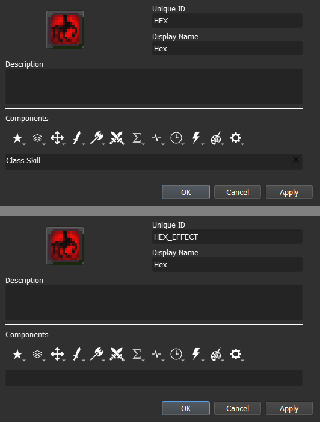

The **Description** can also be the same, but you may remove the distance from it.

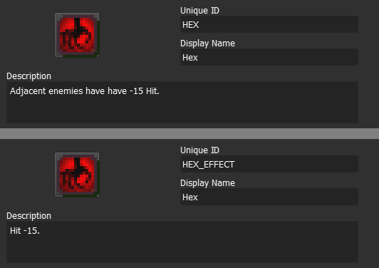

## Step 2.A: Add the Aura component to the Class Skill
Auras are composed of three components - **Aura component**, **Aura Range component** and **Aura Target component**. All of them can be found within the **Status Components** menu, represented by the **Sharp Sound Wave icon**.

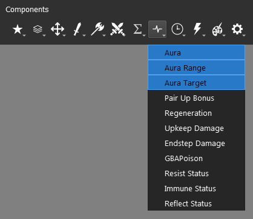

Once you add one of them, the other two will be added as well, and the same applies to removal.

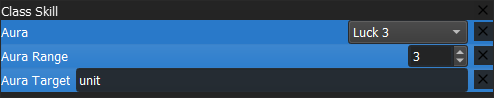

|Component Name|Description|Value|
|--|--|--|
|**Aura**|Defines the effect (**Skill**) that will be applied.|Skill
|**Aura Range**|Defines the radius of the aura, in a rhombus shape.|Integer
|**Aura Target**|Defines if the aura will target allies or enemies.|Object - **ally**, **enemy** or **unit** (both ally and enemy)

For the **Aura component**, we want to set it to the ID of the other skill we created. We also need to set the **Aura Range component** to the corresponding distance - 1 for *Hex* and 3 for *Bond* and *Focus*. At last, the Aura Target should take *enemy* for *Hex* and *ally* for *Bond*. Focus will be assigned once we get into its dedicated step.

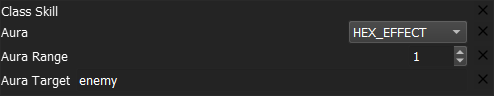

The SKILL will be displayed as any other skill in the **unit information window**, meanwhile the effect will be displayed in the status section for every unit that is affected.

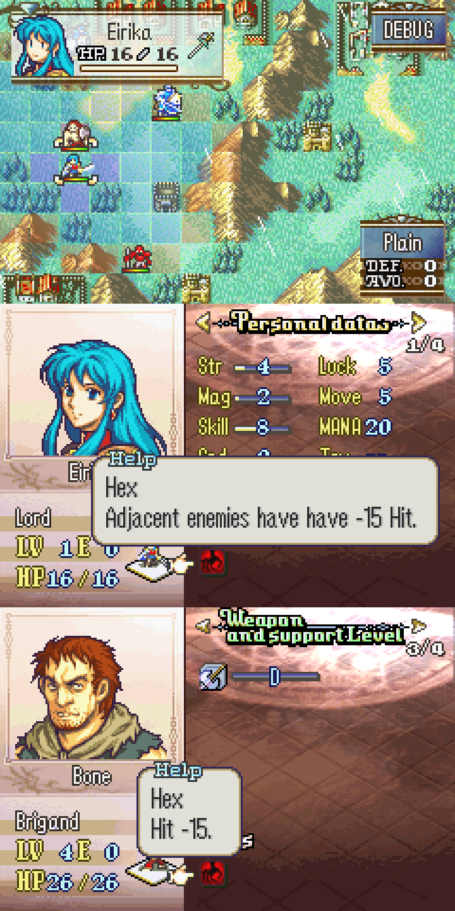

## Step 3: Add the other components to the 'Effect Skill'

### Step 3.A: [Hex] Add the Hit component
The end result should look like this:

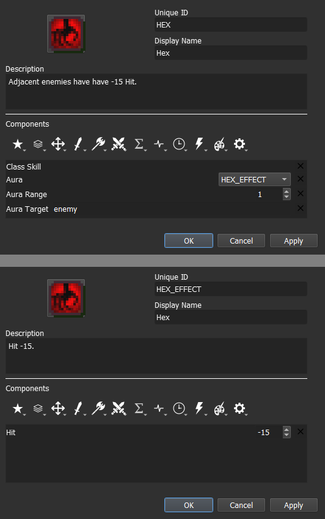

### Step 3.B: [Bond] Add the Upkeep Damage component

The **Upkeep Damage component** can also be found within the **Status Component** menu.

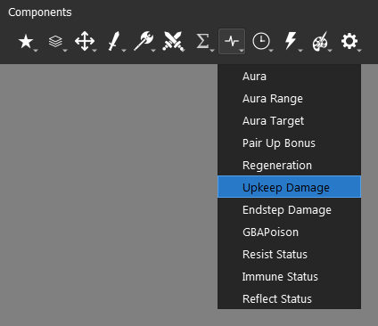

**Upkeep** is the term used to refer to the beginning of the phase. For instance, a player unit's upkeep is the beginning of the player phase, and an enemy unit's upkeep is the beginning of the enemy phase.

We can convert this component into a healing effect by assigning a negative value. The end result should look like this:

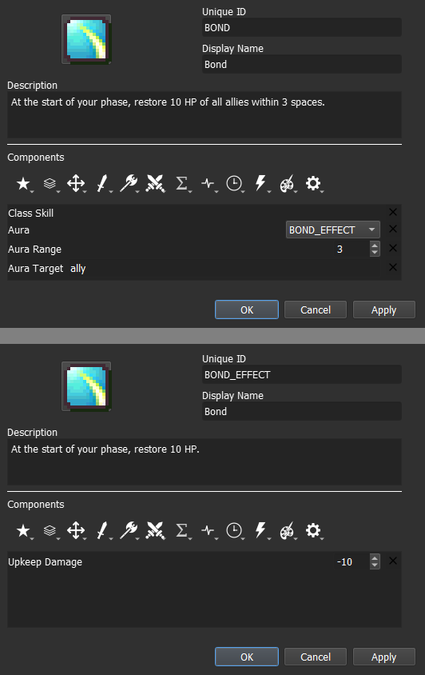

## Step 2.B → 3.C: [Focus] Add the Condition component to the Class Skill
Focus will be significantly different from the other two. We don't actually need the **Aura component** for this skill, since this skill does not affect other units. Its only role here will be aesthetic, to show the range of the at which focus is gained.

The only requirement to make it into a tracker is to set the **Aura Target component** value to *None*.

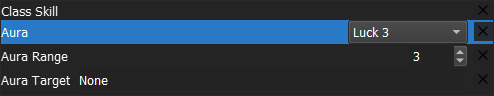

Ideally, we should also set the **Aura component** value to a '*generic empty skill*' instead of a dedicated *'Effect Skill'*, as it can be reused for any other range tracker.

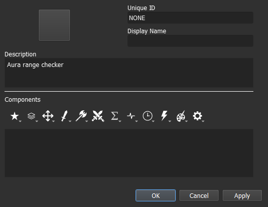

For our condition, we need to use a method that comes with the **Lex Talionis** engine. The file **unit_funcs** (*Unit Functions*) contains some methods that expand on the **unit** object scope and/or interact with other objects outside it.

To check how many enemy units are within the user radius, we can use the method **unit_funcs.check_focus(unit, {integer})**. This method can take two values, the first is a **unit** and the second should be an integer number greater than 0. The {integer} value is set to 3 by default if no value is assigned. Our line should be:

	unit_funcs.check_focus(unit, 3)

**or**

	unit_funcs.check_focus(unit)

Now we add our conditional operator to check whether there are exactly 0 ally units within a range of 3:

	unit_funcs.check_focus(unit, 3) == 0

The end result should look like this:

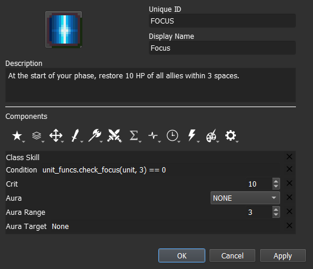

## Step 4: Test the stat alterations and effects in-game
For auras in particular, we need more units to be on our testing map. Set at least one ally and one enemy unit, then move the unit with the aura skill to check if the effects are applied when the ally or enemy is inside the aura radius.

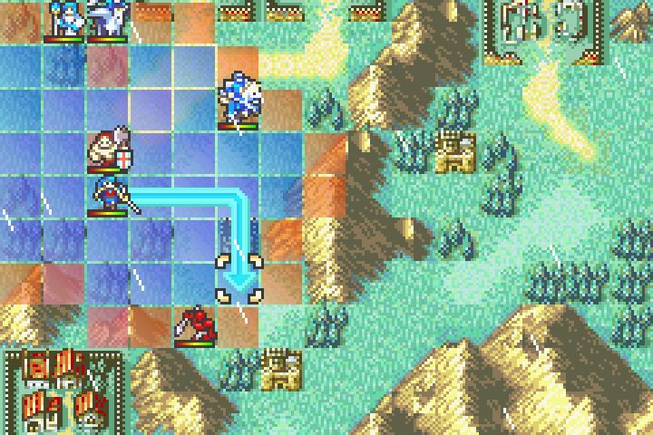

The aura radius will also be displayed whenever you hover over any unit that carries an aura, even enemy units.

## Optional Step: Add the Hidden component to the 'Effect Skill'
By default, every skill added to an unit will be displayed as an inspectable element, either as a class skill or as a status, in the **unit information window**. We can disable that property by adding the **Hidden component**, found within the **Attribute Components** menu.

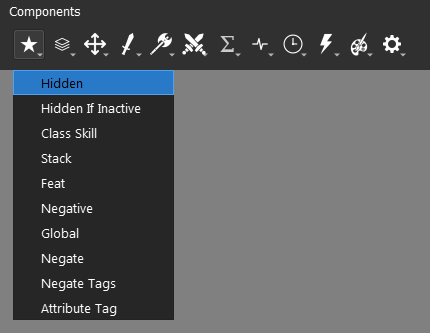
