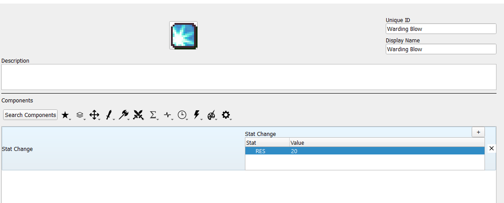
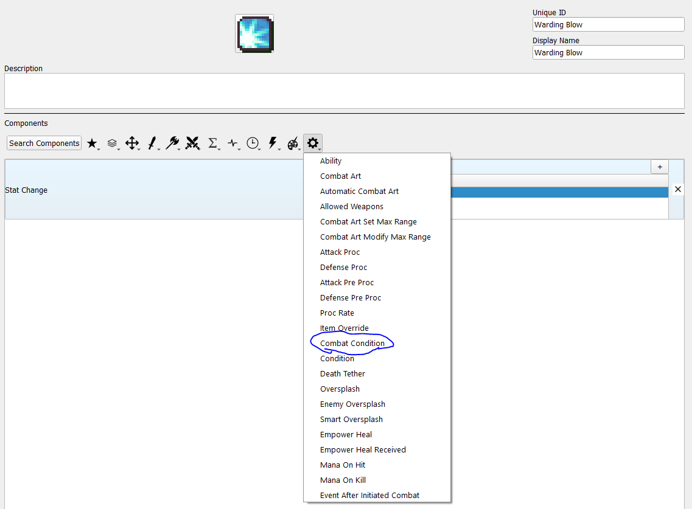
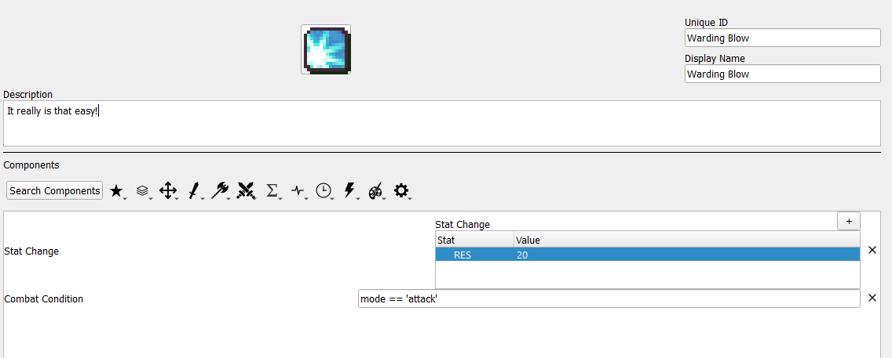
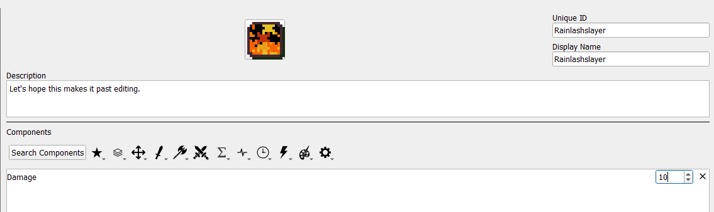
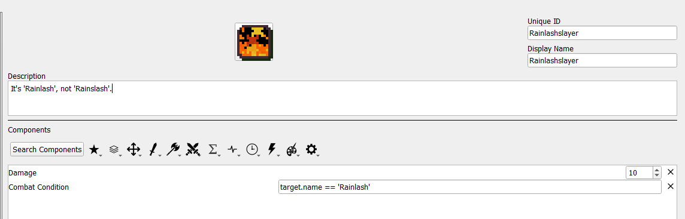

# 4. Conditional Passives II - Warding Blow, Rainlashslayer
Some skills have conditions that have combat-specific conditions that must be met before becoming active. This guide illustrates how to set up skills of that nature.

This section assumes you have already read and understood Conditional Passives I.

## Required editors and components
* Skills:
	* Attribute components - Class Skills
	* Combat components - Damage, Stat Change
	* **Advanced components - Combat Condition**
* **Objects, Attributes and Properties:**
	* **mode**
	* **unit - name**

## Skill descriptions
 - **Warding Blow** - +20 RES when attacking.
 - **Rainlashslayer** - +10 damage against units named Rainlash.
 
## Combat Condition Overview

The Combat Condition component gives access to additional information available only during combat. However, a skill with this component is always treated as inactive outside of combat.

The additional information granted by this component is: the target of the attack and the mode of the attack.

The target available in the Combat Condition is a unit object, so you can use any information from the target that you could use from your own unit, such as the get_hp() and get_max_hp() used in the Wrath tutorial.

The mode is one of two values: 'attack' if the holder of the skill initiated combat, and 'defense' if the target initiated combat.

## Warding Blow

The first step is to set up what your skill is supposed to do when it's active. In the case of Warding Blow, when it's active, it gives +20 RES. Your skill should look like this to start:

Since Warding Blow only activates while attacking, you need a variable that tracks whether the unit with Warding Blow is attacking or not, which is the 'mode' mentioned above. First, you need to include the Combat Condition component.

Since Warding Blow is active when attacking, the condition you need to check is mode == 'attack', so just toss that in and you're done!

## Rainlashslayer

Once again, we begin with an empty template and add what the skill does when it's active. In this case, the skill will grant +10 damage when active.

As before, since this skill activates only when there is another combatant, we need to use the Combat Condition component to get information about that combatant.

In this case, we want our skill to trigger any time the target is named Rainlash. For this, we will not check the target's nid as there can be multiple unique units all named Rainlash. Instead, we can use the target's name field.

As mentioned earlier, any of the target's fields can be used in this component, such as their class, stats, and even favorite foods (if you bother to set up Unit Notes).

As with any conditional, it is possible to create more complex setups if needed, such as a skill that occurs only if the unit is attacking and the target's name is Rainlash. Go nuts.