<small>`Originally written by Hillgarm. Last Updated 2022-09-01`</small>

# 3. Conditional Passives III - Tomefaire, Axe Breaker and Wyrmbane
This guide is a follow up on **Conditional Passives I - Lucky Seven, Odd Rhythm, Wrath and Quick Burn**, and will cover other common elements used for conditions.

By the end of it, you should be able to create the majority of the iconic passive skills in any Fire Emblem game.

**INDEX**
* **Required editors and components**
* **Skill descriptions**
* **Step 1: Check and adjust the Weapon Types in your project**
	* Step 1.A: Create a new Weapon Type
	* Step 1.B: Replace Anima, Light and Dark with Tome
* **Step 2: Create a Class Skill**
* **Step 3: Add the Combat Components**
* **Step 4: Add a conditional component**
	* Step 4.A: **[Tomefaire]** Add and set the Condition component
	* Step 4.B: **[Axe Breaker]** Add and set the Combat Condition component
	* Step 4.C: **[Wyrmbane]** Add and set the Combat Condition and the Condition component
* **Step 5: Test the stat alterations in-game**

## Required editors and components
* Skills:
	* Attribute components - Class Skills
	* Combat components - Avoid, Hit, Crit and **Damage** and  **Damage Multiplier**
	* Advanced components - Condition and **Combat Condition**
* **Weapon Types**
* Classes
* Objects, Attributes and Methods:
	* unit - **get_weapon()**
	* **target** - **get_weapon()** and **tags**
	* **item_system** - **weapon_type({unit object}, {item object})**

## Skill descriptions
 - **Tomefaire** - Might +5 when equipped with a tome.
 - **Axe Breaker** - Hit/Avoid +50 when enemy is equipped with an axe.
 -  **Wyrmbane** - Deals effective damage to dragon units while the user is a (transformed) Manakete.

## Step 1: Check and adjust the Weapon Types in your project
Depending on how much you changed your project, it might be a good idea to check certain elements in order to ensure they will work properly with any tutorial. It is mandatory for you to know the exact **Unique ID** of the referenced elements or else engine won't be able to retrieve the data nor interact with it.

We'll need to ensure our **Weapon Types** are compatible with what we will use, create a new one for *Wyrmbane* and merge all magic into Tome to create *Tomefaire*.

I will also cover an option for *Anima*, *Dark* and *Light* but it's highly recommended to do so in advance for the *Shadowgift* guide, tough you may replace it with any other kind of sub weapon. You may skip this step completely if you haven't changed any of the default **Weapon types** nor need to add a new one.

The **Weapon Types Editor** can be found within the **Edit Menu**.

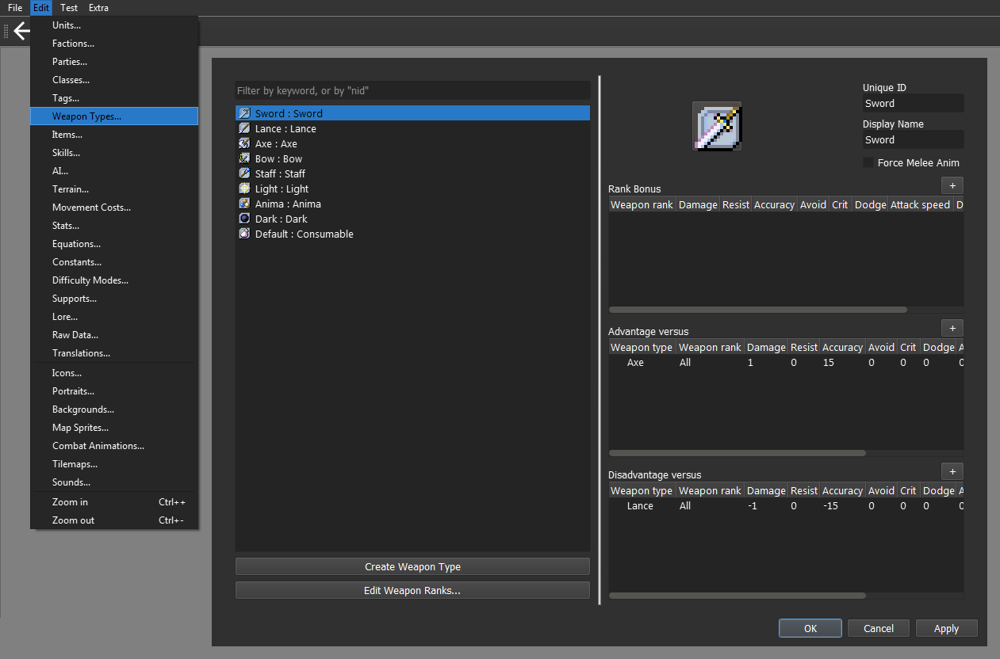

### Step 1.A: Create a new Weapon Type

We can now create a new Weapon Type. For this guide, we will create Dragonstone and set its **Unique ID** to *Wyrm*.

It should look like this:

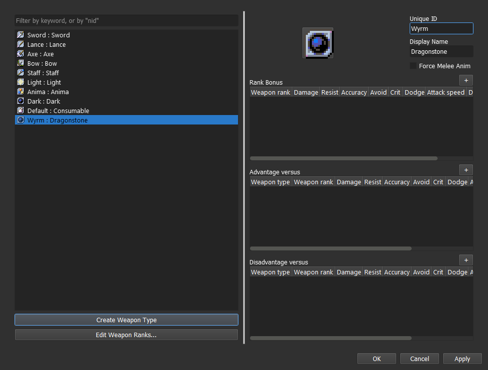

There's also the option to create a Manakate class instead but that isn't the best option to replicate the effects. If that's how you want to do it, check the guide that covers the *Dance* ability.

### Step 1.B: Replace Anima, Light and Dark with Tome

For this guide, we'll be changing *Light* **Unique ID** to *Tome* and remove all of the advantages and disadvantages. You can do it by right clicking on them.

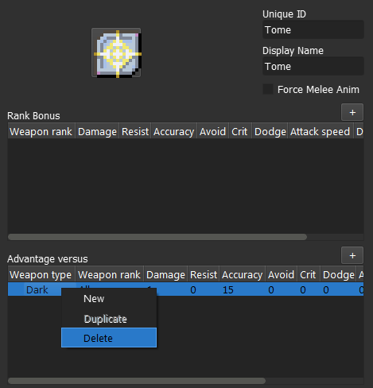

Next, we got to delete *Anima* and *Dark*, also by right clicking on them, and set *Tome* as their replacement.

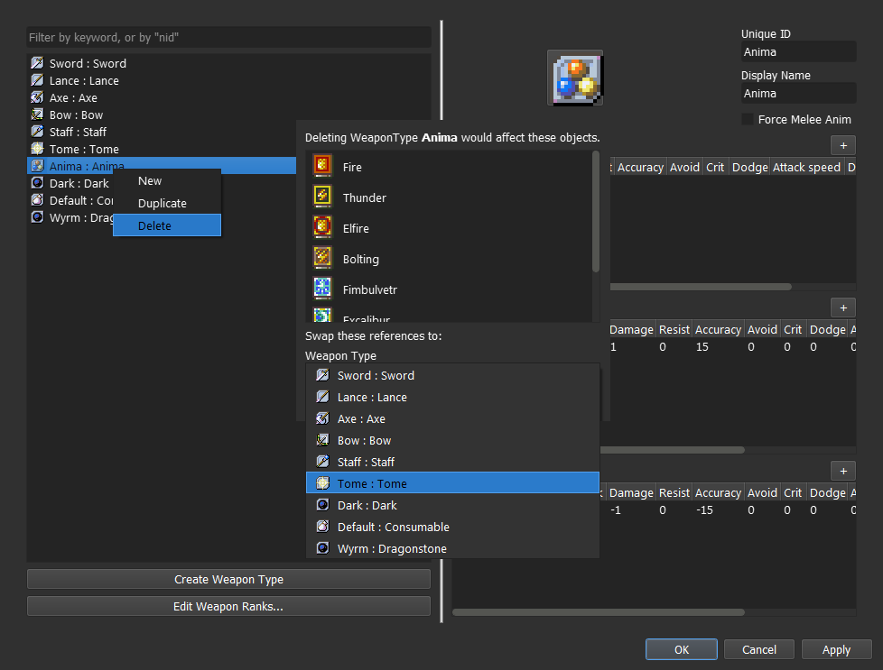

It should look like this:

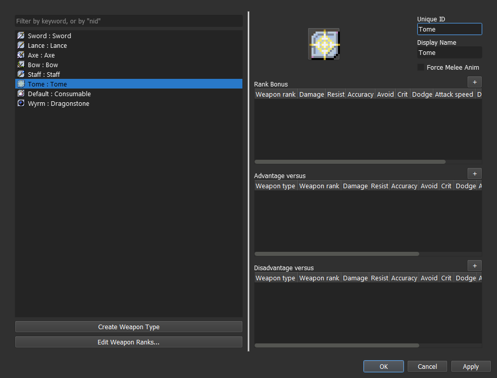

## Step 2: Create a Class Skill

## Step 3: Add the Combat Components
For *Wyrmbane* and *Tomefaire*, we will need the **Damage component**, found within the **Combat Components** menu.

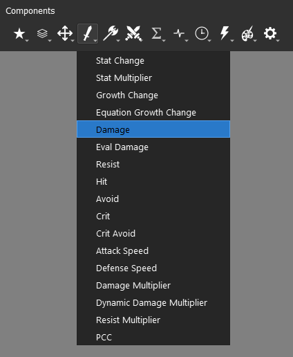

The **Damage component** will increase the **atk** stat by the set amount, which can be checked in the **unit information window**.

We also have the option to use the **Damage Multiplier component** for *Wyrmbane*, also within the **Combat Components** menu.

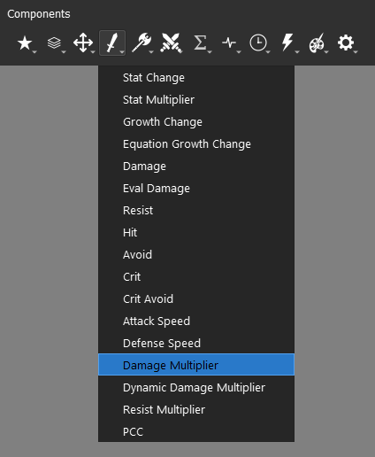

Unlike the direct counterpart, it will only manifest itself when an attack is calculated.

When it comes to weapon effective damage, the standard is flat damage bonus, and it isn't an unified value either. For the sake of consistency, you'd want to use the **Damage component** for our skill, but you may use instead **Damage Multiplier component** if that suits your preferences.

We'll use 5 damage as our bonus for *Wyrmbane*.

## Step 4: Add a conditional component

All the three skills in this guide need two or more conditions to be set, mostly to ensure any potential bug. In order to do that, we need to know the three **logical operators** - **'and'**, **'or'** and **'not'**.

We use them by adding them between two conditions, tying them together. The syntax is:

	<condition A> <logical operator> <condition B>
	<condition A> <logical operator> <condition B> <logical operator> <condition C>
	<condition A> <logical operator> <condition B> <logical operator> <condition C> ... <logical operator> <condition H> ... ∞

The exception is **not**, applied before any logical element.

	not {logical element}
	not <condition>

**'And'** is the one responsible for combining all of the conditions into a larger one, which will return **False** if any of the conditions within isn't fulfilled.

|Operator 'and'|A is True|A is False
|--|--|--
|**B is True**|True|False
|**B is False**|False|False

**'Or'** also combines conditions but it will returning the **True** value if any of the conditions within is fulfilled.

|Operator 'or'|A is True|A is False
|--|--|--
|**B is True**|True|True
|**B is False**|True|False

**'Not'** whole deal is to reverse the value of any logical element or condition.

|Operator 'not'|Result
|--|--
|**A is True**|False
|**A is False**|True

We can combine these into larger conditions and have distinct results. You may tie as many of them as you want, but they will always follow the hierarchy **not** → **and** → **or**, which can be manipulated by setting parenthesis.

We can then set three illustrative examples and calculate the output.

	Orange is not Color and Orange is Vegetable and Orange is Round or Orange is Sour
	not True and False and True or True
	False and False and True or True
	(False and False and True) or True        <<<        solving hierarchy
	False or True
	True

Now we add parenthesis.

	(Orange is not Color and Orange is Vegetable) and (Orange is Round or Orange is Sour)
	(not True and True) and (True or True)
	(False and False) and (True or True)
	False and True
	False

At last, we set a **not** at the start of our first conditional block.

	not (Orange is not Color and Orange is Vegetable) and (Orange is Round or Orange is Sour)
	not (not True and True) and (True or True)
	not (False and False) and (True or True)
	not False and True
	True and True
	True

We could go further by adding more conditions and more parenthesis, but we'd be here forever. These are all the tools we need to create our conditions.

### Step 4.A: [Tomefaire] Add and set the Condition component

For *Tomefaire*, we will be using the **unit object** and **item_system object**. The **item_system object** is responsible for handling multiple methods that connect **units** to their inventory **items**.

The method that retrieves the currently equipped weapon is **get_weapon()**, and it belongs to the **unit object**. It will always return the **item object** equipped if any is available, otherwise it will return **None**.

	unit.get_weapon()

We can then use that method to check if that same weapon matches our skill type. For this, we need the **weapon_type(,)** method within the **item_system** object.

	item_system.weapon_type({unit object}, {item object})

The **item_system** is a mediator and has no internal data regarding the **unit object** nor the **item object**. We need to specify the unit and item in order to use it.

Since our skill is based on the own user, we will set **unit** as our **unit object** and **unit.get_weapon()** as our **item object**.

	item_system.weapon_type(unit, unit.get_weapon())

Next, we specify the **Unique ID** from our required **Weapon Type** in the condition.

	item_system.weapon_type(unit, unit.get_weapon()) == 'Tome'

In case you need to provide a list of **Weapon Types**, the syntax change to:

	item_system.weapon_type(unit, unit.get_weapon()) in ('Weapon Type A', 'Weapon Type B', 'Weapon Type C', ... 'Weapon Type G', ... ∞)

For the standard magic split, we should take it as:

	item_system.weapon_type(unit, unit.get_weapon()) in ('Anima', 'Light', 'Dark')

In practice, this should be enough, but this might lead to some bugs if the skill owner doesn't has an equipable weapon of if its inventory is empty. We can use the get_weapon() method to check that information, and abort it immediately if **None** is found.

	unit.get_weapon() and item_system.weapon_type(unit, unit.get_weapon()) == 'Tome'
								or
	unit.get_weapon() and item_system.weapon_type(unit, unit.get_weapon()) in ('Anima', 'Light', 'Dark')

The end result should look like this:

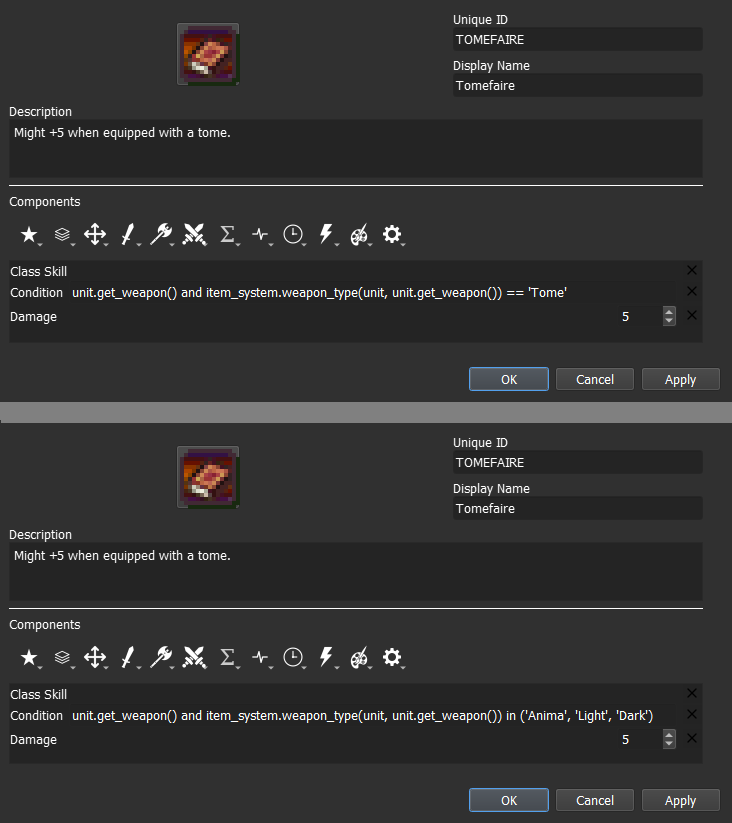

### Step 4.B: [Axe Breaker] Add and set the Combat Condition component

The **Condition component** can only interact with the user and global objects, along their respective methods and attributes. To access other units, we need to use the **Combat Condition component** instead, which can be found within the **Advanced Components** menu.

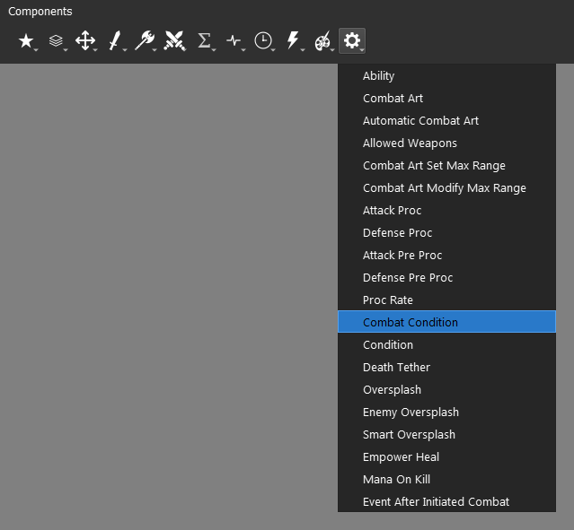

Whenever we need to reference an unit that is selected by an action, we need to use the **target object**. The **target object** is an instance of an **unit object** and will have all the same attributes and methods. You can just replace the referenced object in your syntax.

There can't be a **target object** without an **unit object** to target it and different **units** can have different **targets** at the time. **Targets** can be allies, enemies or even the user itself. It all depends on the context.

When it comes to direct combat, the **target** of the *attacker* will be the *defender*, and the **target** of the *defender* will be the *attacker*.

By replacing the **unit object** and our **Weapon Type** to 'Axe', we will get the following:

	target.get_weapon() and item_system.weapon_type(target, target.get_weapon()) == 'Axe'

The end result should look like this:

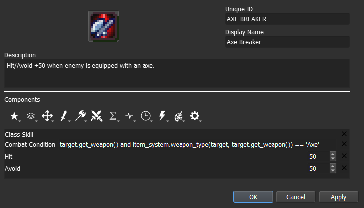

### Step 4.C: [Wyrmbane] Add and set the Combat Condition and the Condition component

At last, we will do the same using both conditional components. It can be done using a single component but it's easier to maintain and adjust by using the two of them. The engine will be computed as if they had the **'and'** operator connecting them.

	<condition component> and <combat condition component>

Effective damage tied to unit **tags**. We can get that information by accessing the **tags** attribute found within **unit object**. Since what matters is the enemy, we will reference **target object** in the **Combat Condition component**.

	'Tag' in target.tags

In a default project, the **tag** we are looking for is 'Dragon', which results in:

	'Dragon' in target.tags

Next, we need to add our weapon restriction. It's the same as the -faire type skills. The **Unique ID** of our new **Weapon Type** was 'Wyrm', and that's all we need to replace from step 4.A.

	unit.get_weapon() and item_system.weapon_type(unit, unit.get_weapon()) == 'Wyrm'

The end result should look like this:

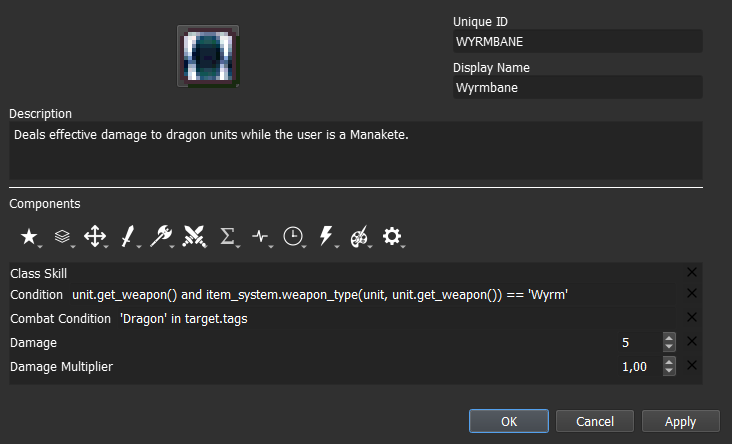

You can see that the **Damage Multiplier component** is present, but it shouldn't be present in the final skill. The only reason it is kept is because the skill can be tested and tuned with either of the options.

We can virtually disable it by setting it at 1,00, and the same can be done to the **Damage component** if we set it to 0. This is just a convenient way to adjust skills before picking the definitive iteration.

## Step 5: Test the stat alterations in-game
