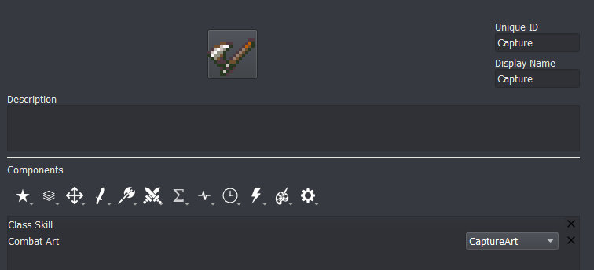
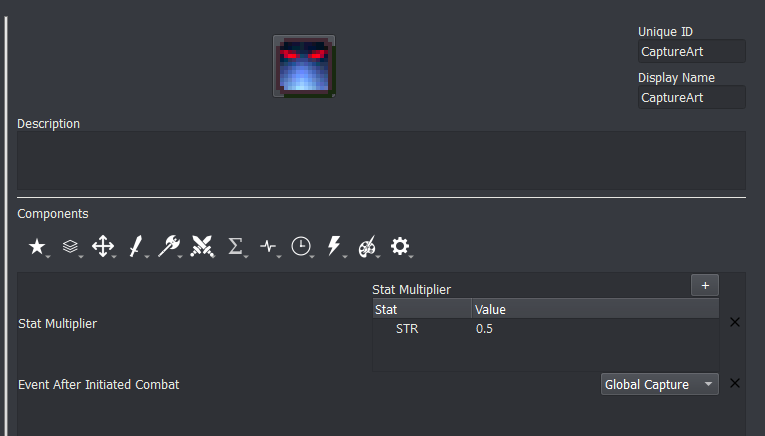
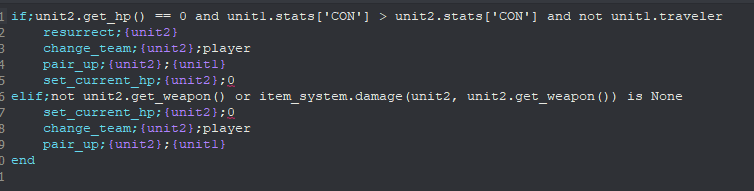
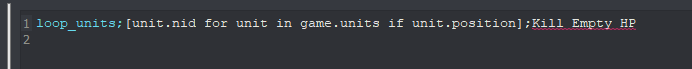
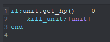
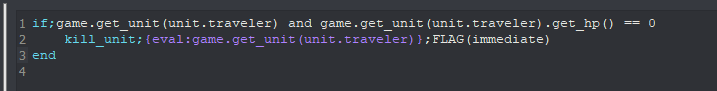
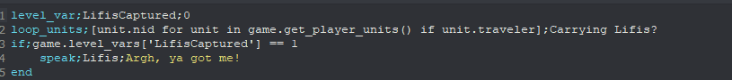
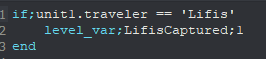

# Capture skill

This tutorial will teach you how to create the capture mechanic from Thracia 776. If you are looking for capture from Fates this will also be a good place to start.

In Thracia 776, capture works the following way: An attack is initiated with stats halved. If the attack reduces the enemy to 0 or less HP, and if the enemy's CON is less than the attacker's CON, the attacker essentially 'rescues' the enemy unit that it's capturing--and can then trade away their items.

We will implement this in Lex Talionis. First, we'll create the capture skill.

Combat Art "CaptureArt" refers to the following skill:

Event After Initiated Combat "Global Capture" refers to an event named Capture in the global section that we'll create later.

Following our desired implementation, attacking with the Capture command will have the unit initiate an attack with their strength, magic, skill, luck, and speed halved. After the battle, the Capture event will be called. Here's what that event looks like:

The Level for this event is Global and the Trigger is None. Let's walk through what's happening here.

In the if statement the event is checking that the defending unit died after combat. After all, we only want to capture units we kill. It then uses an "and" statement to check that the attacker's constitution is greater than the enemy's constitution, again in line with Thracia 776. If you're looking for a more Fates-like capture or aren't using CON, remove this part. Finally, we'll make sure that the attacker isn't already rescuing someone. Alternatively, this could be in a Condition component in the Capture skill.

Within the if statement, a few things happen. First, the dead defender is resurrected. They become a player team unit. The pair_up command might seem confusing - after all, we're capturing, not pairing up - but pair_up can actually be used to rescue a unit if pair up is turned off in Constants. Since the same syntax is used make sure that {unit2} (the defender) is the first parameter. Finally, we set the current health of the now revived defender to 0. That might surprise you, but there's a reason why.

Remember, we need a captured enemy to die when dropped. Units with 0 HP don't actually die until after they are next in combat. Since we'll be keeping our new friend rescued they won't ever be in combat. The next thing we'll do is make sure they die when dropped. You might not, for whatever reason, want units at 0 HP to instantly die while on the field. If that's the case, change the set_current_hp command to set_name and input an appropriate name.

The elif statement denotes a special edge case in Thracia: when an enemy is not wielding a weapon or has a staff equipped. We check to see if the enemy is completely unarmed or has a weapon equipped that cannot deal damage. If so, we capture them no matter what.

We'll now create a new event in the Global level. I called mine "Search for Empty HP" and gave it a trigger of unit_wait.

This is the only line in the event. Loop units can sometimes be hard to understand, so let's break it down. The first parameter (the one surrounded by square brackets) gives the command a list of units that are on the map. The second parameter refers to an event we're about to write named "Kill Empty HP".

**NOTE: Do not let the event editor autofill the second parameter for you!**

Again in the global level, create an event named "Kill Empty HP" with a Trigger of None. The contents of the command should be simple:

If the given unit is at 0 HP, kill it. If you chose to replace the set_current_hp command with set_name before, change the if statement to
`if;unit.name == 'NAMEYOUCHOSEEARLIER'`

Now, a problem might arise if you ended the chapter while holding a captured unit (namely, it would recruit them). Luckily, this shouldn't be a difficult fix. You'll want to find the events in your level where win_game (the command to end the chapter) is called. Prior to the win_game call, add the following line:
`loop_units;[unit.nid for unit in game.get_player_units() if unit.traveler];Kill 0 HP Travelers`

Where Kill 0 HP Travelers refers to the following event in the Global level:

~~~
if;game.get_unit(unit.traveler) and game.get_unit(unit.traveler).get_hp() == 0
    kill_unit;{eval:game.get_unit(unit.traveler)};immediate
end
~~~

And that's it! You should now have a Thracia-style capture system. You can trade with captured units and transfer them between party members, as well as release them to remove them from the map.

If you want to check for the status of a unit at the end of a chapter (i.e., if Lifis is captured by the player at the end of 2x) you'll want to use a similar loop_units setup. Create a game_var or level_var and set it to 0. Construct a block of event code that looks similar to this:

You can see that it refers to another event. That event contains the following:

With this, the game will check if anyone is carrying Lifis!