<small>`Originally written by Hillgarm. Last Updated 2022-09-01`</small>

# 1. Direct Passives - Hit +20, MAG +2 and Gamble
Despite the name, skills are actually effects, which covers everything from statuses (buffs/debuffs) to skills and additional actions. They can be applied into units or terrain, and be triggered by other skills, items, or events. In this tutorial series we will focus on class skills as these can be less intuitive to make.

All of the elements used will be listed at the start of each guide, with the new items written in **bold**. Each step will be fully described at the first time, all following occurrences will be listed as the step name instead.

**INDEX**
* **Required editors and components**
* **Skill descriptions**
* **Step 1: Create a Skill**
	* Step 1.1: Create a Class Skill
* **Step 2: Assign the Skill**
	* Step 2.1A: Assign the Skill to an Unit
	* Step 2.1B: Assign the Skill to a Class
	* Step 2.2: Inspect the skill in-game
* **Step 3: Add a combat components**
	* Step 3.A: **[Hit +20]** Add a Hit component
	* Step 3.B: **[MAG +2]** Add a Stat Change component
	* Step 3.C: **[Gamble]** Add a Stat Change component and a Crit component
* **Step 4: Check the stat alterations in-game**
* **Conclusion**

## Required editors and components
* **Skills:**
	* **Attribute components - Class Skills**
	* **Combat components - Stat Change, Hit and Crit**
* **Units**
* **Classes**

## Skill descriptions
 - **Hit +20** - Grants +20 Hit.
 - **MAG +2** - Grants +2 Magic.
 - **Gamble** - Grants -5 Hit and +10 Crit.

## Step 1: Create a Skill
Open the **Skill Editor** in the **Edit Menu** and create a new **Skill**.

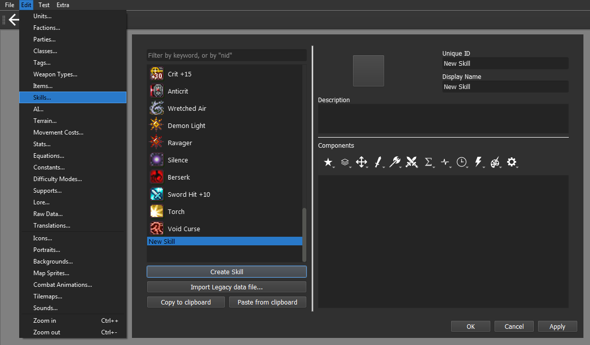

Our new skill has to have a completely unique name for the **Unique ID** field. This will be how the engine will identify which skill is being used or called. By default, the engine will auto fill the **Display Name** with the **Unique ID** value, but you may change it at will. I'll be changing my skill name to be in lower case.

We can also give our skill a **Description** and an **Icon**, these are important for in-game inspection.

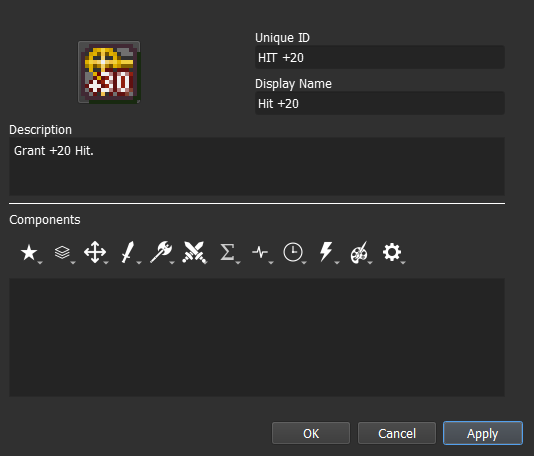

For our skill to do anything, we need to assign **Components**. You can do it by clicking on the icons below the description box, which will open a menu with multiple options to pick from.

### Step 1.1: Create a Class Skill
To make our skill into a proper class skill, we need to give it the **Class Skill** component. The option can be found within the **Attribute Components** menu, represented by the **Star icon**.

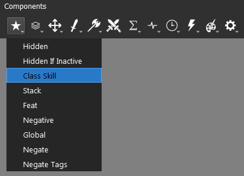

Skills that have the **Class Skill component** will show an inspectable icon under the character's stats. It is recommended to use this component on all personal and class skills.

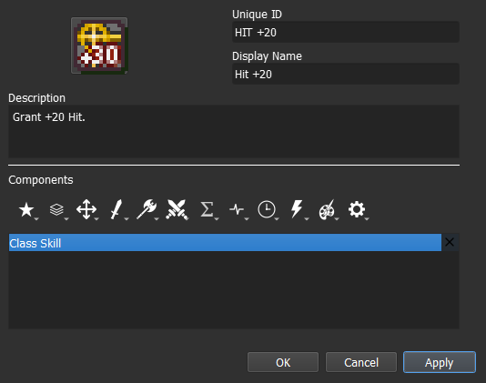

All the added **components** will be displayed individually within the component box. Skills can have as many components as you see fit but only one of each. They can also be reordered by dragging them up and down the box.

You can get some additional information on any given component by hovering over them, both in menu and once they are added. It's a great feature to know if you want to swim on your own.

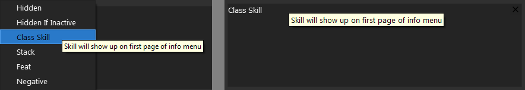

## Step 2: Assign the Skill
Before we get our skill to do anything, we need to know how to assign our skill to a unit for testing purposes. There are a couple of options available but for this tutorial we will stick to the **Class** and **Unit** options. You may choose which one of these methods to use.

We will be using Eirika as our target unit for the following steps.

### Step 2.1A: Assign the skill to an Unit
Open the **Units Editor** in the **Edit Menu** and select the unit that will get the skill. For this tutorial I will select the default **unit** Eirika.

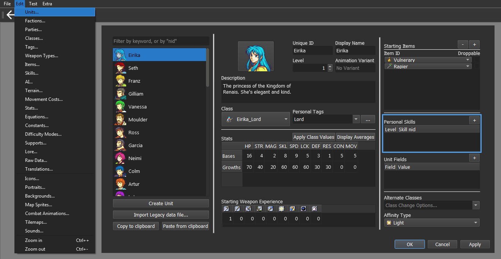

Click on the **+** button on the **Personal Skill** division to give your unit a new skill, then select the desired skill. Keep the **Level** parameter at 1 for testing purposes.

### Step 2.1B: Assign the skill to an Unit
Open the **Classes Editor** in the **Edit Menu** and select the class that will get the skill. For this tutorial I will select the default **class** Eirika_Lord.

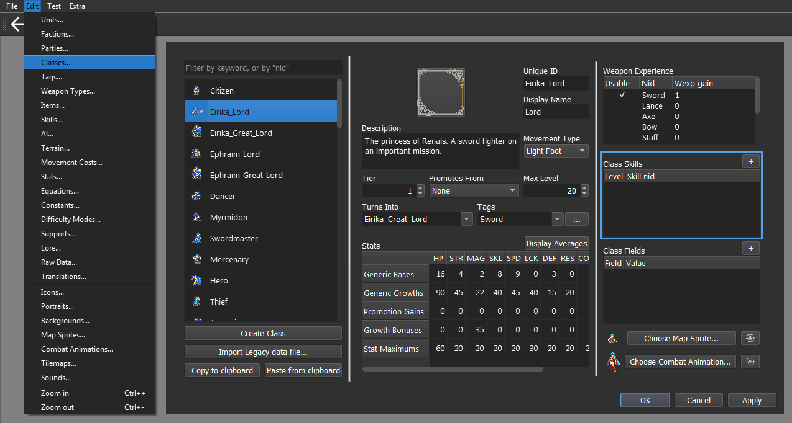

Click on the **+** button on the **Class Skill** division to give it a new skill, then select the desired skill. You may change the **Level** parameter in case you want to test other interactions.

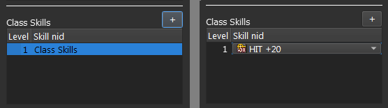

### Step 2.2: Inspect the skill in-game
Select the desired chapter for testing. This chapter must contain at least one unit that had the skill assigned by the chosen method.

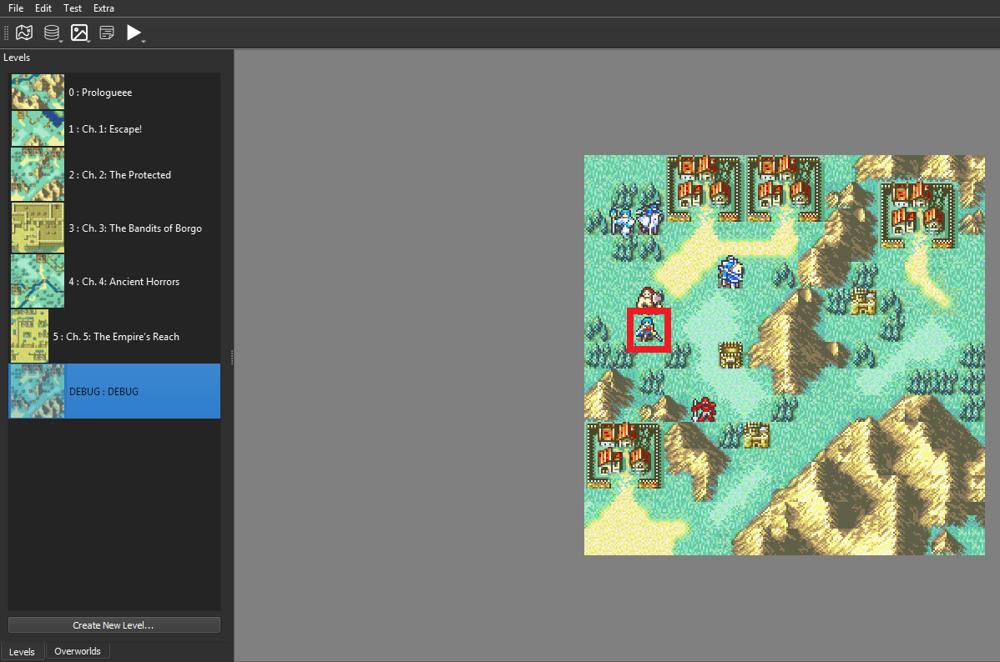

Click on the **Test Current Chapter** (F5) button in the **Test Menu** to run it.

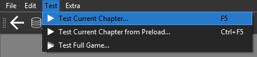

With the game running, we can now inspect the unit with the **Info Key**. The default inputs for it are the **scroll button** (mouse) or the **C key** (keyboard).

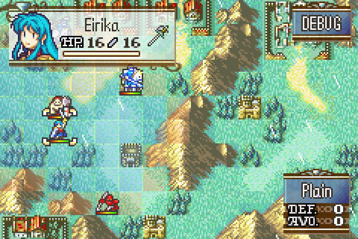

This will open the **unit information window**, allowing you to check which effects are active.

If you assigned the **Class Skill component** to the skill, the icon will displayed at page 1, at the bottom of the screen. Otherwise, it will be displayed at page 3, within the status division, also at the bottom.

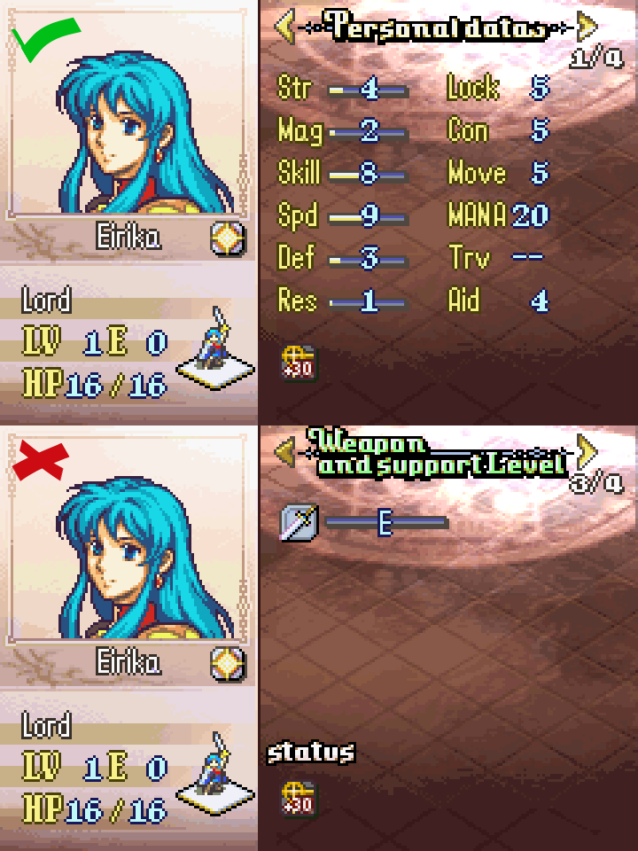

Use the **Info Key** again to check the name and description of your skill.

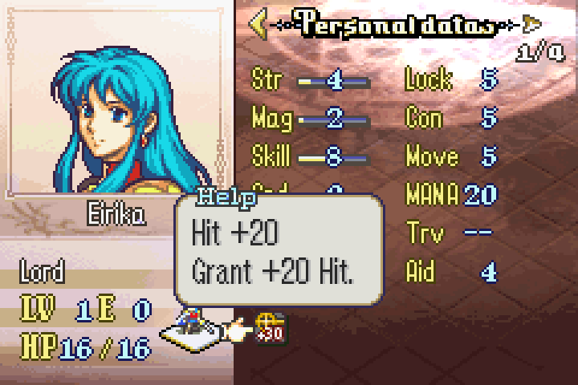

## Step 3: Add combat component
All the components we will use in this tutorial belong to the **Combat Components** menu, represented by the **(Single) Sword icon**.

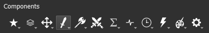

### Step 3.A: [Hit +20] Add a Hit component
For *Hit +20*, we will need the **Hit component**. This component is an individual integer type. It will only apply an increment to the **Hit stat**.

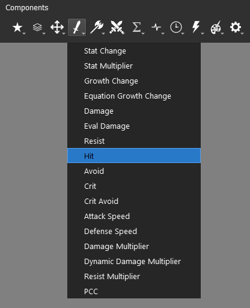

By default, the component will add the value to the **Hit stat**, always being positive, but it can be negative if specified. Set the value to 20.

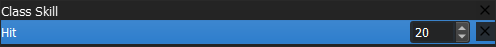

The end result should look like this:

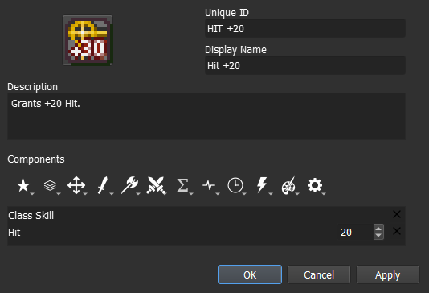

In-game, the **Hit stat** value is always displayed as its total sum. To check if it is working properly, you can enable and disable the skill comparing the stat changes for both scenarios.

### Step 3.B: [MAG +2] Add a Stat Change component
For *MAG +2*, we will need the **Stat Change component**.

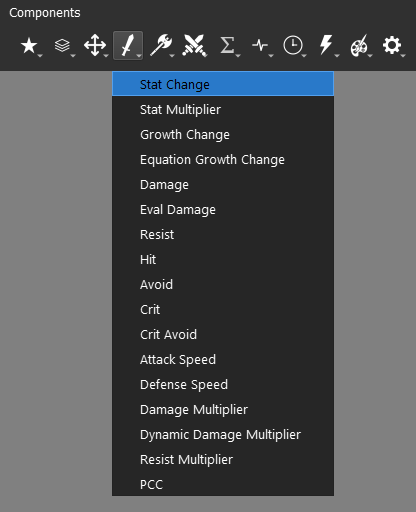

The **Stat Change component** is the one responsible for handling additive **base stats** operations. It is similar to the **Hit component** but instead of being a single stat, it is a list of all base stats. We can add multiple stats to this component.

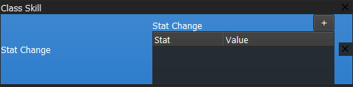

To add a new stat, click on the **+** button. Select the MAG **Stat** and assign its **Value** to 2.

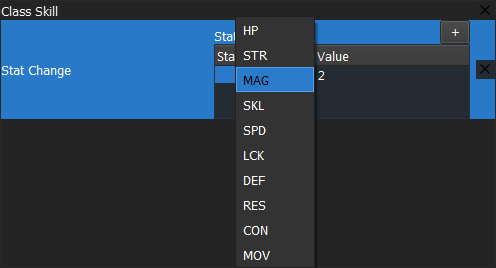

The end result should look like this:

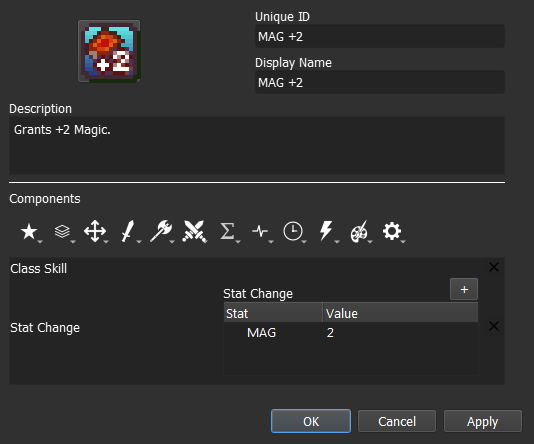

The majority of the **base stats** will have their value split into **base value** and **bonus value** (in green). We can easily check it in-game by inspecting the unit.

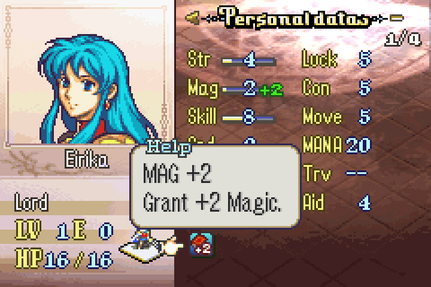

### Step 3.C: [Gamble] Add a Hit component and a Crit component
For Gamble, we need to add both the **Hit component** and the **Crit component**.

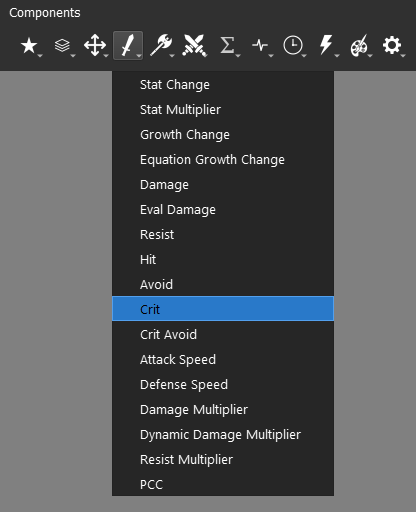

This time we will give **Hit component** a negative value. The end result should look like this:

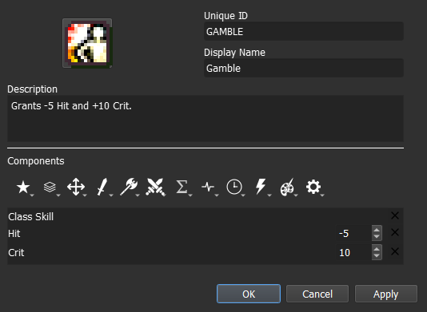

## Step 4: Test the stat alterations in-game
All we have left is to check if our skill is working or not. Run a Test where your playable unit has the skill and check the stats, then do the same without the skill.
