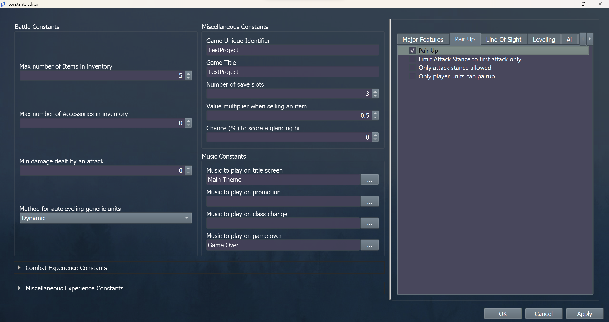
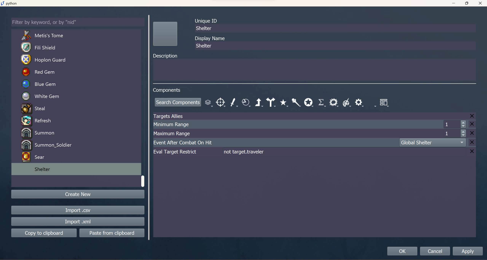
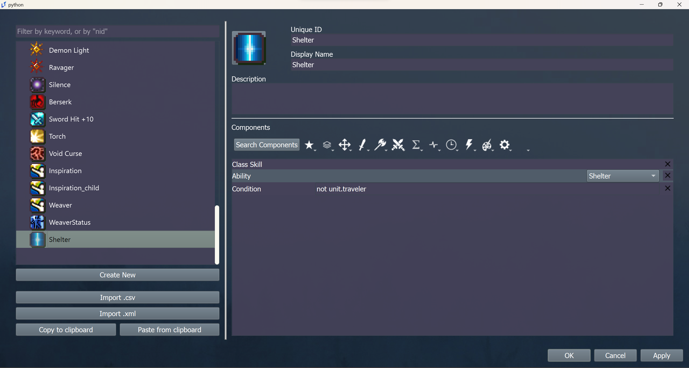

# Shelter Skill

## Description

I want a skill that:

* Grants an ability called **Shelter.**
* When the **ability** is used, an adjacent target becomes the user's pair up partner

## Tutorial

**Step 1: Turn on pair up**

Open the constants editor and enable the pair up constant.

**Step 2: Create an event that does the pairing**

Open the event editor and navigate to global events. In a new event, enter the following code.

~~~
move_unit;{unit2};{unit};normal;stack;no_follow
pair_up;{unit2};{unit}
~~~

Do not set an event trigger. Name the event something like "Shelter".

**Step 3: Create a shelter item**

Open the item editor and create a shelter item.

While you can make the minimum and maximum range whatever you want, this configuration will ensure a system that works like Fates Shelter..

**Step 4: Create a shelter skill**

Open the skill editor and create a shelter skill.

Add a description and skill icon that you like.

**Conclusion**

You're done! Test the skill in a debug map to try it out.