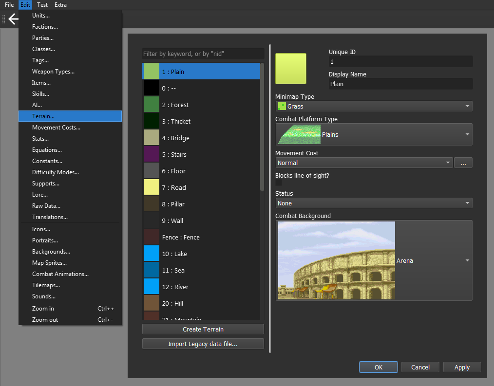
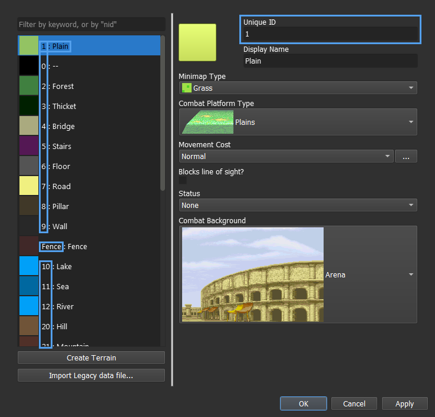
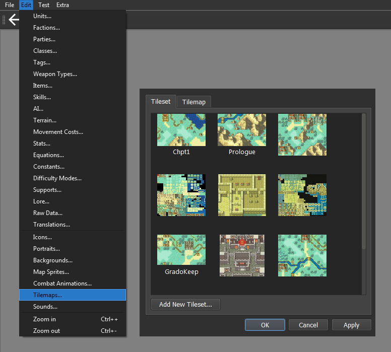
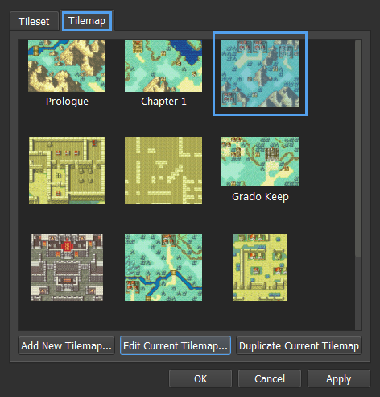
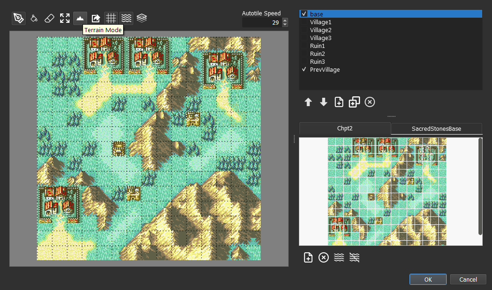
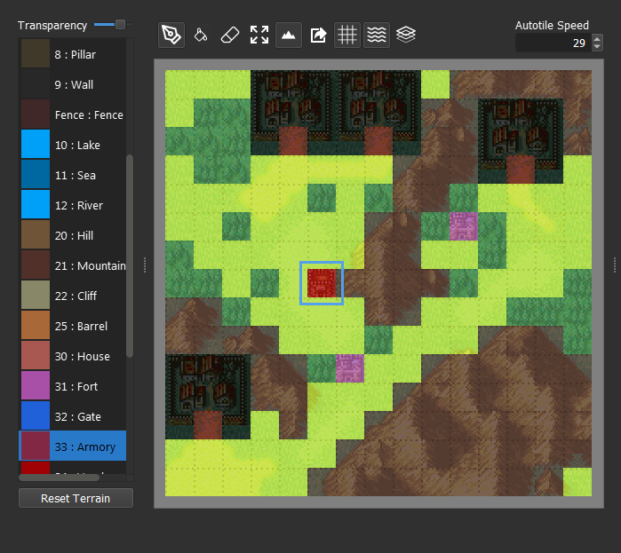
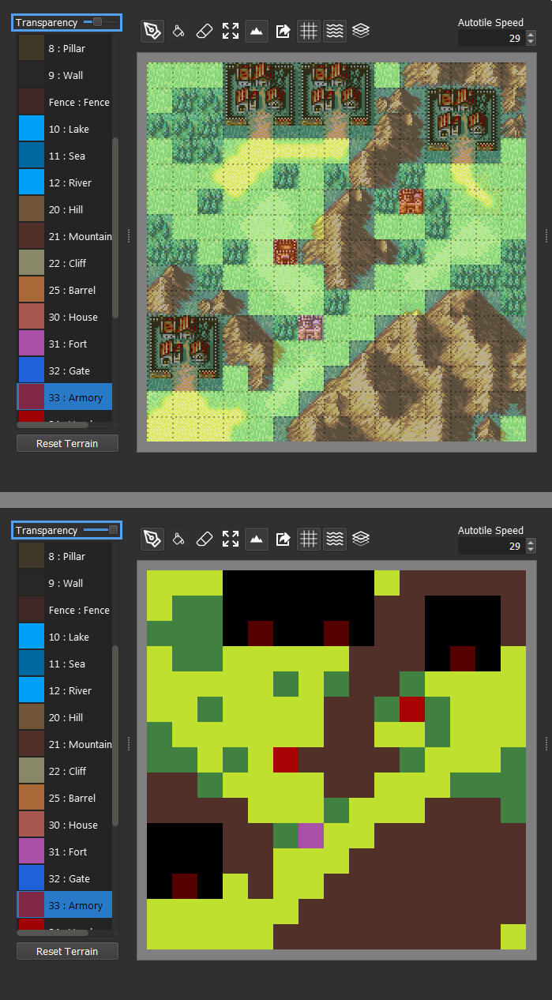
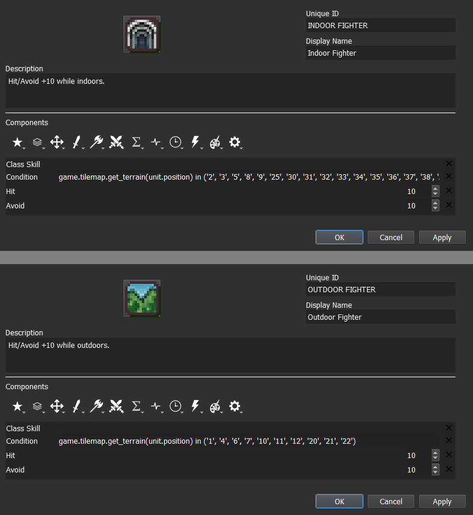

<small>`Originally written by Hillgarm. Last Updated 2022-09-01`</small>

# 4. Tile Oriented Passives - Outdoor Fighter and Indoor Fighter
In this guide we will be building what might be the most exquisite, and fairly limited, kind of skill. Despite that, the principles behind it can be used to create a pletora of interesting skills if properly explored and implemented.

There won't be any split step for this guide as the two skills are direct opposites.

**INDEX**
* **Required editors and components**
* **Skill descriptions**
* **Step 1: Check the Terrains in your project**
	* Step 1.1: Check the maps
* **Step 2: Create a Class Skill**
* **Step 3: Add the Combat Components**
* **Step 4: Add and set the Condition component**
* **Step 5: Test the stat alterations in-game**

## Required editors and components
* Skills:
	* Attribute components - Class Skills
	* Combat components - Avoid and Hit
	* Advanced components - Condition
* Classes
* Objects, Attributes and Methods:
	* unit - **position**
	* game - **tilemap**
	* **tilemap - get_terrain({coordinates})**

## Skill descriptions
- **Indoor Fighter** - Hit/Avoid +10 while indoors.
- **Outdoor Fighter** - Hit/Avoid +10 while outdoors.

## Step 1: Check the Terrains in your project
We need to write down all the **Unique IDs** for each terrain that will be used in our skill. It will be completely arbitrary based on what you will take as indoors or outdoors.

If you haven't changed any of the default project **terrain**, there shouldn't be much to do in this step. The complete list will be available at a later sub-step but it is recommended to take a look so you can know how to adapt it to other skills and how to fix in case you add any new **terrain**.

The **Terrain Editor** can be found within the **Edit Menu**.

The default project has numbers assigned as the **Unique ID**, with a few exceptions. They are right before the terrain name **(Display Name)**.

In case you haven't done a single change to terrain, you can use the following lists.

For indoors:

	'2', '3', '5', '8', '9', '25', '30', '31', '32', '33', '34', '35', '36', '37', '38', 'Arena', 'Ruins', 'Village Ruins'

For outdoors:

	'1', '4', '6', '7', '10', '11', '12', '20', '21', '22'

The final result may differ a lot depending on your project.

### Step 1.1: Check the maps
In case you don't know much about map editing and how the engine handles it, you'll likely want to be sure that the map is properly set.

Each tile has two major properties - *visual* and ***terrain***. This means that whenever add a forest sprite tile to your map you'll also need to set that tile **terrain** as a forest, otherwise it won't understand it as such.

By disassociating these properties, we can create special tiles that have a specific visual but a different terrain property, such as creating an invisible barrier or maybe even a trap tile.

As a downside, it also means that it is possible for **terrain** to unintentionally mismatch. We can fix that in the **Tilemaps Editor**, found within the **Edit Menu**.

Select the **Tilemap** tab and the map that uses the same layout as the test map and click on **Edit Current Tilemap...** We will use DEBUG as our test map in this guide.

Click on the **Terrain Mode** button, represented by the **Mountain icon**.

We can now see the **terrain** version of the map along the tools to modify it.

You can left click on a tile to select that terrain.

And right click a tile to attribute the current terrain to it.

We change the **transparency** by moving the slider at the top left.

With this, we can be sure our tiles are matching their respective terrains. You can run the chapter and move over each tile to see if you get the right caption.

This allows us to test tiles without changing the visual completely.

We can also change the terrain color at the **Terrain Editor**.

Now that our map is set, we can finally create our two skills.

## Step 2: Create a Class Skill

## Step 3: Add the Combat Components

## Step 4: Add and set the Condition component
All information regarding the tiles is stored in the **tilemap object**, which an only be accessed through the **global object game**. The terrain information can be retrieved by using the **get_terrain() method**. All we have to do is to give it a valid *'X, Y' coordinate*.

	game.tilemap.get_terrain({coordinate})

Every **unit** on the map also has an *'X, Y' coordinate*, stored in the **position attribute**.

	unit.position

Then, combined as:

	game.tilemap.get_terrain(unit.position)

We can now make our condition by comparing it to a list containing all of ours **Terrain** **Unique IDs**.

	game.tilemap.get_terrain(unit.position) in (... , ...)

And as better illustrative example:

	game.tilemap.get_terrain(unit.position) in ('1' , '5', '776', 'Grave', 'Dragon Bone')

The end result should look somewhat similar to this:

## Step 5: Test the stat alterations in-game
